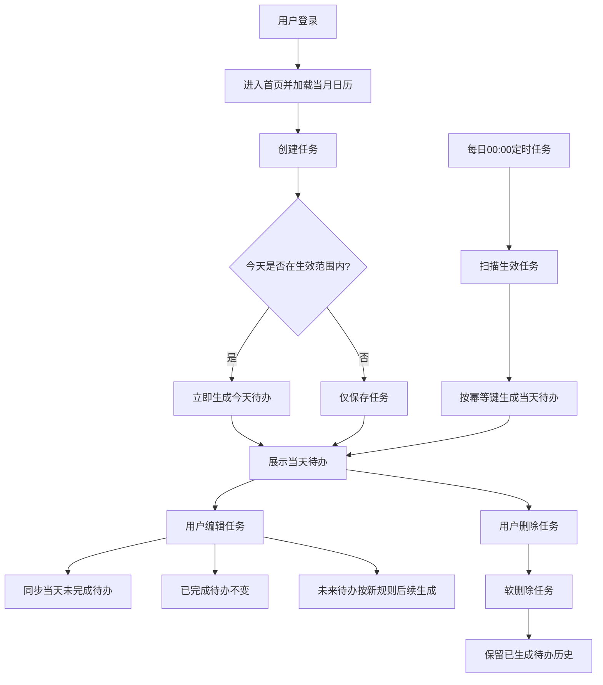
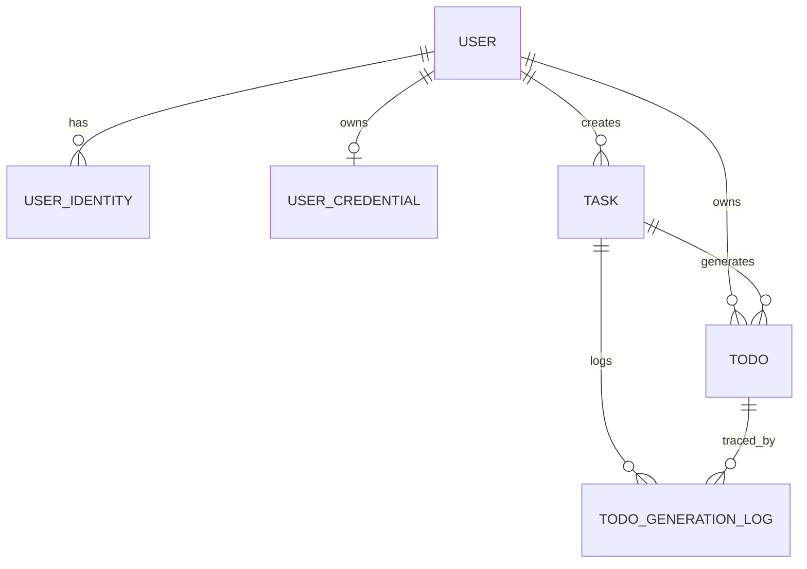

# PRD模板

# 一、版本信息

| **系统版本** | v1 | **创建日期** |   | **撰写人** | 谢天 |
| -------- | -- | -------- | - | ------- | -- |

# 二、变更日志

| **时间** | **文档版本** | **变更人** | **主要变更内容** |
| ------ | -------- | ------- | ---------- |
|        | v1       | 谢天      | 创建文档       |

# 三、需求概述

## 需求背景 

每天都有很多需要完成的待办，但是一段时间过去后，并不知道过去哪天的待办完成了，哪天没完成，不过清晰明了，也不能督促自己完成任务，所以计划开发一个小程序，用程序管理目标。

## 需求目标

- 让用户在首页即可快速感知「今天该做什么、做了多少、还差多少」，形成每日执行闭环。  
- 让用户可以使用工具随时随地查看待办，完成待办

## 方案说明

简单描述实现需求的产品方案

## 用户故事

| **#** | **用户故事**                          | **验收标准** | **优先级** | **版本** |
| ----- | --------------------------------- | :------- | ------- | ------ |
| US-01 | 作为用户，我希望首页看到当月日历并默认选中当天，以便快速定位当天待办。 | 打开首页默认展示当月；当天突出显示；可切换日期查看对应日期的待办。 | P0 | v1 |
| US-02 | 作为用户，我希望在日历中看到每天待办完成情况，通过明显的颜色区分快速回顾执行情况。 | 过去日期的待办完成情况必须有状态标记：已完成/未全部完成/无待办。 | P0 | v1 |
| US-03 | 作为用户，我希望新增任务后默认开始结束日期选择当天，以便快速记录不打断。 | 点击新增后默认日期为今天；可保存成功并出现在当天列表。 | P0 | v1 |
| US-04 | 作为用户，我希望每天 0 点自动生成当天待办，以便减少重复创建。 | 每日 0 点自动生成成功；同一天不重复生成；失败可补偿。 | P0 | v1 |
| US-05 | 作为用户，我希望勾选完成待办后能实时更新当天进度，以便获得即时反馈。 | 完成状态切换后，日历状态同步刷新。 | P0 | v1 |
| US-06 | 作为用户，我希望查看历史某天的待办明细，以便复盘执行问题。 | 点击历史日期可查看该日待办清单及完成情况。 | P1 | v1 |
| US-07 | 作为用户，我希望按月观察整体完成分布，以便持续督促自己。 | 月视图可完整显示当月每日状态，不遗漏无待办天。 | P1 | v1 |

## 系统规划

| **版本** | **功能** | **预计上线日期** |
| ------ | ------ | :--------- |
| v1.0（第一阶段） | 任务创建、任务修改、任务删除、待办删除、月历视图（含当天高亮与历史状态色） | TBD |
| v1.1（第二阶段） | 通知功能（待办提醒、未完成提醒、提醒开关与时间配置） | TBD |
| v1.2（第三阶段） | AI总结功能（日报/周报/月报，完成率与执行趋势分析） | TBD |

# 四、整体说明

## 业务术语

| **类型** | **术语** | **说明** |
| ------ | ------ | :----- |
| 业务概念 | 任务（Task） | 用户定义的计划规则实体，决定在什么时间范围内生成待办。 |
| 业务概念 | 待办（Todo） | 每日执行的具体事项，由任务生成或即时生成。 |
| 业务概念 | 生效范围 | 任务可生成待办的日期区间（开始/结束日期）。 |
| 业务概念 | 日历状态 | 某日期的完成状态：已完成/未完成/当天未完成/无待办。 |
| 业务概念 | 0点生成 | 每日 00:00 定时生成当天待办的批处理机制。 |
| 业务概念 | 补偿生成 | 0点生成失败后，按日志进行补跑生成。 |
| 业务概念 | 软删除 | 标记删除，不物理移除数据，历史可追溯。 |
| 系统概念 | 用户（User） | 业务主用户实体，所有任务与待办归属到 userId。 |
| 系统概念 | 身份映射（UserIdentity） | 外部登录身份与 userId 的映射关系。 |
| 系统概念 | 凭证（UserCredential） | 账号密码登录场景下的密码哈希与安全状态。 |
| 系统概念 | 幂等键 | 唯一约束 `(userId, taskId, todoDate)`，防重复生成。 |
| 系统概念 | JWT | 服务端签发的访问令牌，用于接口鉴权。 |
| 系统概念 | TraceId | 请求链路追踪标识，用于日志排障。 |

## 权限设计

### 角色定义

- 普通用户：可管理自己的任务与待办，查看自己的日历与统计。  
- 系统管理员（预留）：仅用于系统维护与审计，不参与普通业务操作。  

### 资源与动作权限

| 角色 | 资源 | 动作 | 权限规则 |
| :-- | :-- | :-- | :-- |
| 普通用户 | task | 创建/查询/修改/删除 | 仅可操作 `userId=本人` 的任务 |
| 普通用户 | todo | 查询/完成/删除 | 仅可操作 `userId=本人` 的待办 |
| 普通用户 | 日历统计 | 查询 | 仅可查看 `userId=本人` 的统计结果 |
| 普通用户 | user_profile | 查询/修改 | 仅可修改本人昵称、头像等非敏感信息 |
| 普通用户 | user_identity/user_credential | 查询（受限） | 仅允许查看脱敏后的登录方式信息 |
| 系统管理员 | 审计日志 | 查询 | 仅用于故障排查与审计，禁止修改业务数据 |

### 权限控制规则

- 所有接口必须先鉴权（JWT），再做资源归属校验（`resource.userId == token.userId`）。  
- 前端隐藏按钮不等于权限控制，后端必须强校验。  
- 对跨用户访问统一返回 403。  

## 流程说明

### 文字流程

1. 用户登录后进入首页，默认展示当月日历并选中当天。  
2. 用户创建任务时，若当天落在任务生效范围内，系统立即生成当天待办。  
3. 每天 00:00 定时任务扫描生效中的任务，批量生成当天待办（幂等去重）。  
4. 用户编辑任务后：仅同步更新当天未完成待办；当天已完成待办保持不变；未来待办按新规则生成。  
5. 用户删除任务时仅软删除任务，已生成待办历史不删除。  
6. 用户完成/删除待办后，日历状态与统计即时刷新。  

### Mermaid流程图

## 实体关系

## 数据结构

### 实体一：user（用户实体）

| 字段名 | 数据类型 | 必填 | 说明 |
| :-- | :--- | :- | :- |
| _id | string | 是 | 用户ID（业务主键） |
| nickname | string | 否 | 昵称 |
| avatarUrl | string | 否 | 头像地址 |
| status | number | 是 | 1=正常，0=禁用 |
| lastLoginAt | number | 否 | 最近登录时间戳（毫秒） |
| createdAt | number | 是 | 创建时间戳（毫秒） |
| updatedAt | number | 是 | 更新时间戳（毫秒） |

### 实体二：user_identity（用户身份映射）

| 字段名 | 数据类型 | 必填 | 说明 |
| :-- | :--- | :- | :- |
| _id | string | 是 | 映射ID |
| userId | string | 是 | 关联用户ID（对应 user._id） |
| provider | string | 是 | 身份来源（wechat_miniprogram/password/web/electron） |
| identityKey | string | 是 | 通用身份唯一标识（小程序=openid，密码登录=标准化账号） |
| openid | string | 否 | 微信openid（仅 provider=wechat_miniprogram 时有值） |
| unionid | string | 否 | 微信unionid（同主体多应用统一标识） |
| createdAt | number | 是 | 创建时间戳（毫秒） |
| updatedAt | number | 是 | 更新时间戳（毫秒） |

### 实体三：user_credential（账号密码凭证）

| 字段名 | 数据类型 | 必填 | 说明 |
| :-- | :--- | :- | :- |
| _id | string | 是 | 凭证ID |
| userId | string | 是 | 关联用户ID（对应 user._id） |
| passwordHash | string | 是 | 密码哈希（禁止明文存储） |
| passwordAlgo | string | 是 | 哈希算法标识（如 argon2id） |
| passwordUpdatedAt | number | 是 | 密码更新时间戳（毫秒） |
| failedLoginCount | number | 是 | 连续失败次数 |
| lockUntil | number | 否 | 锁定截止时间戳（毫秒） |
| createdAt | number | 是 | 创建时间戳（毫秒） |
| updatedAt | number | 是 | 更新时间戳（毫秒） |

### 实体四：task（任务实体）

| 字段名 | 数据类型 | 必填 | 说明 |
| :-- | :--- | :- | :- |
| _id | string | 是 | 任务ID |
| userId | string | 是 | 用户ID |
| title | string | 是 | 任务标题 |
| remark | string | 否 | 备注说明 |
| effectiveStartDate | string(date) | 是 | 生效开始日期（yyyy-MM-dd） |
| effectiveEndDate | string(date) | 否 | 生效结束日期（yyyy-MM-dd，为空表示长期有效） |
| repeatRule | object | 是 | 重复规则（默认daily，后续可扩展） |
| status | number | 是 | 1=启用，0=停用 |
| isDeleted | boolean | 是 | 软删除标记 |
| version | number | 是 | 任务版本号，编辑后递增 |
| createdAt | number | 是 | 创建时间戳（毫秒） |
| updatedAt | number | 是 | 更新时间戳（毫秒） |
| deletedAt | number | 否 | 删除时间戳（毫秒） |

### 实体五：todo（待办实例）

| 字段名 | 数据类型 | 必填 | 说明 |
| :-- | :--- | :- | :- |
| _id | string | 是 | 待办ID |
| userId | string | 是 | 用户ID |
| taskId | string | 是 | 来源任务ID |
| taskVersion | number | 是 | 生成时任务版本号 |
| todoDate | string(date) | 是 | 待办所属日期（yyyy-MM-dd） |
| triggerType | string | 是 | 触发类型（create_task/cron_0000/retry） |
| title | string | 是 | 待办标题（从任务快照下沉） |
| completedAt | number | 否 | 完成时间戳（毫秒） |
| status | number | 是 | 0=失效，1=未完成, 2=已完成 |
| isDeleted | boolean | 是 | 软删除标记 |
| createdAt | number | 是 | 创建时间戳（毫秒） |
| updatedAt | number | 是 | 更新时间戳（毫秒） |
| deletedAt | number | 否 | 删除时间戳（毫秒） |

### 实体六：todo_generation_log（待办生成日志）

| 字段名 | 数据类型 | 必填 | 说明 |
| :-- | :--- | :- | :- |
| _id | string | 是 | 日志ID |
| userId | string | 是 | 用户ID |
| taskId | string | 是 | 任务ID |
| todoDate | string(date) | 是 | 目标生成日期（yyyy-MM-dd） |
| triggerType | string | 是 | 触发类型（create_task/cron_0000/retry） |
| result | string | 是 | 执行结果（success/skipped_duplicate/failed） |
| todoId | string | 否 | 成功生成时对应待办ID |
| errorCode | string | 否 | 失败错误码 |
| errorMessage | string | 否 | 失败信息 |
| traceId | string | 否 | 链路追踪ID |
| createdAt | number | 是 | 创建时间戳（毫秒） |

### 用户与身份关联关系

- `user` 与 `user_identity` 为一对多关系：一个用户可绑定多个身份来源。  
- `user` 与 `user_credential` 为一对一（可选）关系：仅当存在账号密码登录时才有记录。  
- 登录识别流程（小程序）：`wx.login(code)` -> 服务端换取 `openid` -> 查 `user_identity(provider, identityKey)` -> 定位 `userId` -> 签发 JWT。  
- 登录识别流程（账号密码）：服务端先按账号查 `user_identity(provider=password, identityKey=标准化账号)` -> 再校验 `user_credential.passwordHash` -> 成功后签发 JWT。  

### 关键约束与规则

- 创建任务时，若当天在任务生效范围内，立即生成当天待办。  
- 每天 0 点自动为生效中的任务生成当天待办。  
- 编辑任务后：  
  - 同步更新当天「未完成」待办；  
  - 当天「已完成」待办不做修改；  
  - 未来待办按新任务规则在后续 0 点生成。  
- 删除任务仅软删除 `task`，不影响已生成待办历史。  
- 待办幂等唯一键：`(userId, taskId, todoDate)`，防止重复生成。  
- 日历状态计算口径：  
  - 无待办：`todoCount=0`；  
  - 已完成：`completedCount=todoCount`；  
  - 未完成：`completedCount=0 且 todoCount>0`；  
  - 部分完成：`0<completedCount<todoCount`。  

### 索引建议

- `user`：`(status)`  
- `user_identity`：唯一索引 `(provider, identityKey)`、`(userId)`  
- `user_credential`：唯一索引 `(userId)`  
- `task`：`(userId, isDeleted, status)`、`(userId, effectiveStartDate, effectiveEndDate)`  
- `todo`：`(userId, todoDate)`、`(userId, todoDate, status)`、唯一索引 `(userId, taskId, todoDate)`  
- `todo_generation_log`：`(userId, todoDate)`、`(taskId, todoDate)`  

## 功能结构

mermaid格式的功能结构导图

## 功能清单

通过优先级区分开发顺序

| **一级模块** | **二级模块** | **功能** | **功能描述** | **优先级** | **状态** |
| -------- | -------- | ------ | -------- | ------- | :----- |
|          |          |        |          |         |        |

### 状态说明

状态机或者数据的几种状态说明

| **状态** | **前置条件** | **后置条件** | **备注** |
| ------ | -------- | -------- | ------ |
|        |          |          |        |

## 页面布局

ASCII文字版线框图，页面整体布局

# 五、功能需求

## 模块名称

### 页面原型

ASCII文字版线框图

### 页面说明

| **#** | **对象** | **说明**      |
| ----- | ------ | ----------- |
|       | 页面作用说明 |             |
|       | 页面布局   |             |
|       | 数据来源   | 数据来源和默认查询条件 |

### 权限说明

| **#** | **角色** | **权限** |
| ----- | ------ | ------ |
|       |        |        |

### 查询说明

| **#** | **对象** | **交互说明** | **逻辑说明** | **备注** |
| ----- | ------ | -------- | -------- | ------ |
|       |        |          |          |        |

### 列表说明

描述列表字段及其功能

| **#** | **对象**  | **交互说明**       | **逻辑说明** | **备注** |
| ----- | ------- | -------------- | -------- | ------ |
|       | 列表排序    |                |          |        |
|       | 列表行数据维度 | 说明哪些字段确定唯一一条数据 |          |        |

### 功能说明

说明用户可操作的功能和程序规则

| **#** | **对象** | **交互说明** | **逻辑说明** | **备注** |
| ----- | ------ | -------- | -------- | ------ |
|       |        |          |          |        |

### 状态说明

状态机或者数据的几种状态说明

| **状态** | **前置条件** | **后置条件** | **备注** |
| ------ | -------- | -------- | ------ |
|        |          |          |        |

# 六、非功能需求

## 数据埋点

## 性能要求

# 七、上线准备及检查

## 权限配置

## 历史数据迁移

## 初始化数据
