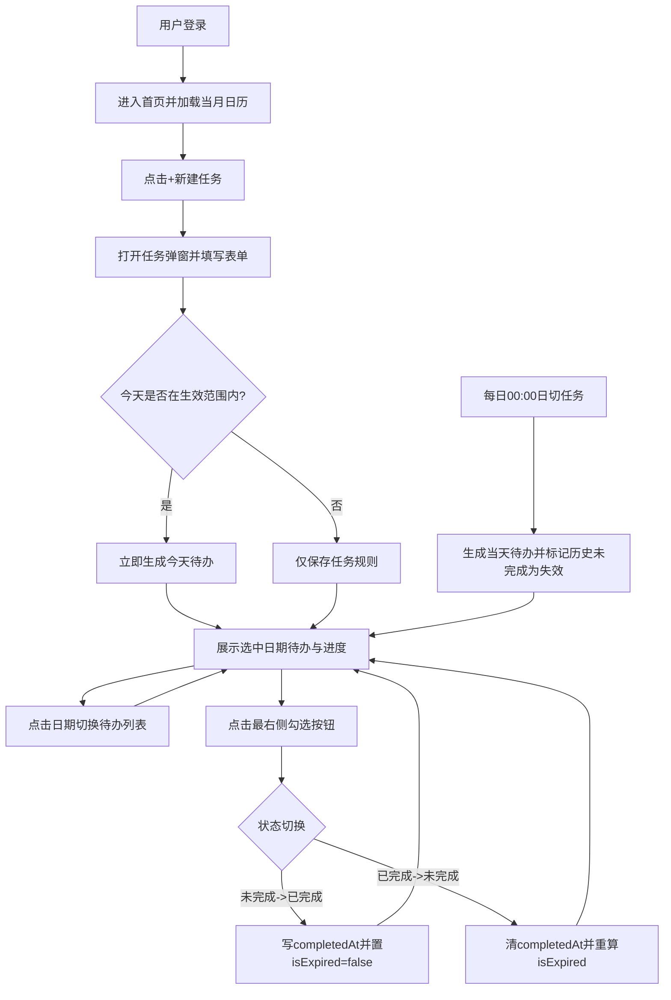
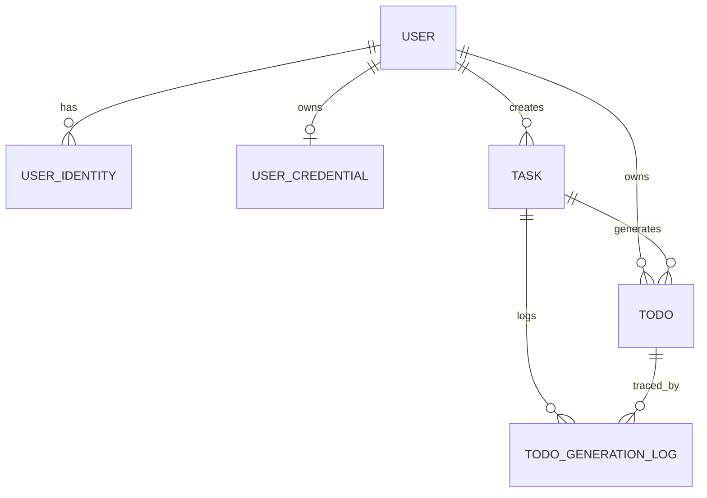
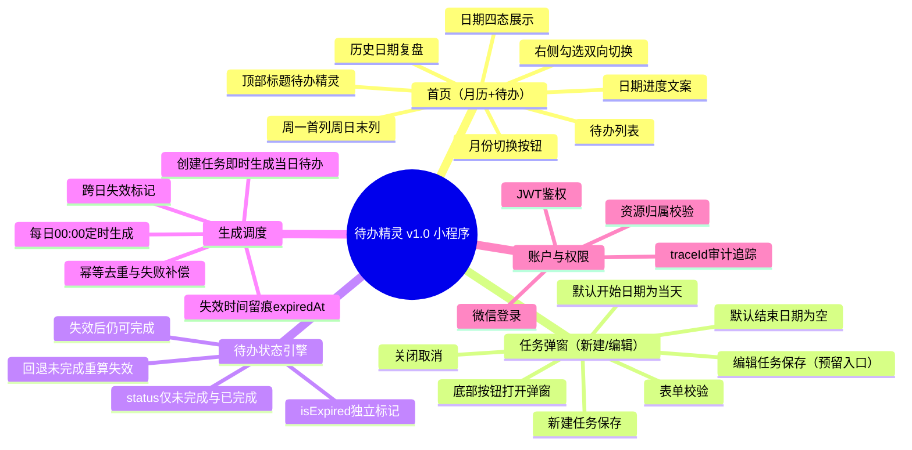

# PRD模板

# 一、版本信息

| **系统版本** | v1 | **创建日期** |   | **撰写人** | 谢天 |
| -------- | -- | -------- | - | ------- | -- |

# 二、变更日志

| **时间** | **文档版本** | **变更人** | **主要变更内容** |
| ------ | -------- | ------- | ---------- |
|        | v1       | 谢天      | 创建文档       |

# 三、需求概述

## 需求背景 

每天都有很多需要完成的待办，但是一段时间过去后，并不知道过去哪天的待办完成了，哪天没完成，不过清晰明了，也不能督促自己完成任务，所以计划开发一个小程序，用程序管理目标。

## 需求目标

- 让用户在首页即可快速感知「今天该做什么、做了多少、还差多少」，形成每日执行闭环。  
- 让用户可以使用工具随时随地查看待办，完成待办

## 方案说明

简单描述实现需求的产品方案

## 用户故事

| **#** | **用户故事** | **验收标准** | **优先级** | **版本** |
| ----- | -------- | -------- | ------- | ------ |
| US-01 | 作为用户，我希望首页默认展示当月日历并选中当天，以便进入即用。 | 首次进入显示当月，默认选中当天，支持切换任意日期。 | P0 | v1.0 |
| US-02 | 作为用户，我希望日历能清晰区分日期执行结果，以便快速复盘。 | 日历状态仅有四类：已完成/历史未完成/当日未完成/无待办。 | P0 | v1.0 |
| US-03 | 作为用户，我希望在首页直接看到选中日期的完成进度。 | 日历下方显示文案：`YYYY-MM-DD 已完成X/共Y`，且随勾选实时变化。 | P0 | v1.0 |
| US-04 | 作为用户，我希望勾选按钮固定在待办最右侧，并支持双向切换。 | 点击右侧勾选可在未完成/已完成间切换，切换后列表与日历状态实时刷新。 | P0 | v1.0 |
| US-05 | 作为用户，我希望已失效待办仍可继续完成。 | 待办跨日未完成自动标记失效；补完成后 `isExpired=false`。 | P0 | v1.0 |
| US-06 | 作为用户，我希望只在首页完成复盘，不需要单独历史页。 | 点击历史日期即可查看当日待办，不提供独立历史待办页面。 | P0 | v1.0 |
| US-07 | 作为用户，我希望新增任务通过弹窗完成，避免页面跳转打断。 | 点击“+新建任务”打开任务弹窗，默认开始日期为当天，结束日期留空即长期有效。 | P0 | v1.0 |

## 系统规划

| **版本** | **功能** | **预计上线日期** |
| ------ | ------ | :--------- |
| v1.0（第一阶段） | 小程序：首页（月历+待办）+任务弹窗（新建/编辑），支持待办双向勾选、日切失效、日历四态 | TBD |
| v1.1（第二阶段） | 通知功能（待办提醒、未完成提醒、提醒开关与时间配置） | TBD |
| v1.2（第三阶段） | AI总结功能（日报/周报/月报，完成率与执行趋势分析） | TBD |
| v1.3（第四阶段） | 其他客户端 | TBD |

# 四、整体说明

## 业务术语

| **类型** | **术语** | **说明** |
| ------ | ------ | :----- |
| 业务概念 | 任务（Task） | 用户定义的计划规则实体，决定在什么时间范围内生成待办。 |
| 业务概念 | 待办（Todo） | 每日执行的具体事项，由任务生成或即时生成。 |
| 业务概念 | 生效范围 | 任务可生成待办的日期区间（开始/结束日期）。 |
| 业务概念 | 日历状态 | 某日期的完成状态：已完成/历史未完成/当日未完成/无待办。 |
| 业务概念 | 0点日切 | 每日 00:00 执行“生成当天待办+标记历史未完成为已失效”的批处理机制。 |
| 业务概念 | 补偿生成 | 0点生成失败后，按日志进行补跑生成。 |
| 业务概念 | 软删除 | 标记删除，不物理移除数据，历史可追溯。 |
| 系统概念 | 用户（User） | 业务主用户实体，所有任务与待办归属到 userId。 |
| 系统概念 | 身份映射（UserIdentity） | 外部登录身份与 userId 的映射关系。 |
| 系统概念 | 凭证（UserCredential） | 账号密码登录场景下的密码哈希与安全状态。 |
| 系统概念 | 幂等键 | 唯一约束 `(userId, taskId, todoDate)`，防重复生成。 |
| 系统概念 | JWT | 服务端签发的访问令牌，用于接口鉴权。 |
| 系统概念 | TraceId | 请求链路追踪标识，用于日志排障。 |

## 权限设计

### 角色定义

- 普通用户：可管理自己的任务与待办，查看自己的日历与统计。  
- 系统管理员（预留）：仅用于系统维护与审计，不参与普通业务操作。  

### 资源与动作权限

| 角色 | 资源 | 动作 | 权限规则 |
| :-- | :-- | :-- | :-- |
| 普通用户 | task | 创建/查询/修改/删除 | 仅可操作 `userId=本人` 的任务 |
| 普通用户 | todo | 查询/状态切换 | 仅可操作 `userId=本人` 的待办 |
| 普通用户 | 日历统计 | 查询 | 仅可查看 `userId=本人` 的统计结果 |
| 普通用户 | user_profile | 查询/修改 | 仅可修改本人昵称、头像等非敏感信息 |
| 普通用户 | user_identity/user_credential | 查询（受限） | 仅允许查看脱敏后的登录方式信息 |
| 系统管理员 | 审计日志 | 查询 | 仅用于故障排查与审计，禁止修改业务数据 |

### 权限控制规则

- 所有接口必须先鉴权（JWT），再做资源归属校验（`resource.userId == token.userId`）。  
- 前端隐藏按钮不等于权限控制，后端必须强校验。  
- 对跨用户访问统一返回 403。  

## 流程说明

### 文字流程

1. 用户登录后进入首页，默认展示当月日历并选中当天。  
2. 用户点击底部“+新建任务”打开任务弹窗，默认开始日期为当天，结束日期留空即长期有效。  
3. 用户保存任务时，若当天在任务生效范围内，系统立即生成当天待办。  
4. 用户点击某日期后，系统拉取该日期待办，并展示 `已完成X/共Y` 进度。  
5. 用户点击待办最右侧勾选按钮可双向切换状态：未完成↔已完成。  
6. 每天 00:00 执行日切任务：生成当天待办，并将昨日及更早未完成待办标记为失效。  
7. 历史日期复盘在首页内完成，不提供独立历史待办页面。  

### Mermaid流程图



## 实体关系



## 数据结构

### 实体一：user（用户实体）

| 字段名 | 数据类型 | 必填 | 说明 |
| :-- | :--- | :- | :- |
| _id | string | 是 | 用户ID（业务主键） |
| nickname | string | 否 | 昵称 |
| avatarUrl | string | 否 | 头像地址 |
| status | number | 是 | 1=正常，0=禁用 |
| lastLoginAt | number | 否 | 最近登录时间戳（毫秒） |
| createdAt | number | 是 | 创建时间戳（毫秒） |
| updatedAt | number | 是 | 更新时间戳（毫秒） |

### 实体二：user_identity（用户身份映射）

| 字段名 | 数据类型 | 必填 | 说明 |
| :-- | :--- | :- | :- |
| _id | string | 是 | 映射ID |
| userId | string | 是 | 关联用户ID（对应 user._id） |
| provider | string | 是 | 身份来源（wechat_miniprogram/password/web/electron） |
| identityKey | string | 是 | 通用身份唯一标识（小程序=openid，密码登录=标准化账号） |
| openid | string | 否 | 微信openid（仅 provider=wechat_miniprogram 时有值） |
| unionid | string | 否 | 微信unionid（同主体多应用统一标识） |
| createdAt | number | 是 | 创建时间戳（毫秒） |
| updatedAt | number | 是 | 更新时间戳（毫秒） |

### 实体三：user_credential（账号密码凭证）

| 字段名 | 数据类型 | 必填 | 说明 |
| :-- | :--- | :- | :- |
| _id | string | 是 | 凭证ID |
| userId | string | 是 | 关联用户ID（对应 user._id） |
| passwordHash | string | 是 | 密码哈希（禁止明文存储） |
| passwordAlgo | string | 是 | 哈希算法标识（如 argon2id） |
| passwordUpdatedAt | number | 是 | 密码更新时间戳（毫秒） |
| failedLoginCount | number | 是 | 连续失败次数 |
| lockUntil | number | 否 | 锁定截止时间戳（毫秒） |
| createdAt | number | 是 | 创建时间戳（毫秒） |
| updatedAt | number | 是 | 更新时间戳（毫秒） |

### 实体四：task（任务实体）

| 字段名 | 数据类型 | 必填 | 说明 |
| :-- | :--- | :- | :- |
| _id | string | 是 | 任务ID |
| userId | string | 是 | 用户ID |
| title | string | 是 | 任务标题 |
| remark | string | 否 | 备注说明 |
| effectiveStartDate | string(date) | 是 | 生效开始日期（yyyy-MM-dd） |
| effectiveEndDate | string(date) | 否 | 生效结束日期（yyyy-MM-dd，为空表示长期有效） |
| repeatRule | object | 是 | 重复规则（默认daily，后续可扩展） |
| status | number | 是 | 1=启用，0=停用 |
| isDeleted | boolean | 是 | 软删除标记 |
| version | number | 是 | 任务版本号，编辑后递增 |
| createdAt | number | 是 | 创建时间戳（毫秒） |
| updatedAt | number | 是 | 更新时间戳（毫秒） |
| deletedAt | number | 否 | 删除时间戳（毫秒） |

### 实体五：todo（待办实例）

| 字段名 | 数据类型 | 必填 | 说明 |
| :-- | :--- | :- | :- |
| _id | string | 是 | 待办ID |
| userId | string | 是 | 用户ID |
| taskId | string | 是 | 来源任务ID |
| taskVersion | number | 是 | 生成时任务版本号 |
| todoDate | string(date) | 是 | 待办所属日期（yyyy-MM-dd） |
| triggerType | string | 是 | 触发类型（create_task/cron_0000/retry） |
| title | string | 是 | 待办标题（从任务快照下沉） |
| completedAt | number | 否 | 完成时间戳（毫秒） |
| status | number | 是 | 1=未完成，2=已完成 |
| isExpired | boolean | 是 | 是否失效（true=已失效，false=未失效） |
| expiredAt | number | 否 | 首次失效时间戳（毫秒） |
| isDeleted | boolean | 是 | 软删除标记 |
| createdAt | number | 是 | 创建时间戳（毫秒） |
| updatedAt | number | 是 | 更新时间戳（毫秒） |
| deletedAt | number | 否 | 删除时间戳（毫秒） |

### 实体六：todo_generation_log（待办生成日志）

| 字段名 | 数据类型 | 必填 | 说明 |
| :-- | :--- | :- | :- |
| _id | string | 是 | 日志ID |
| userId | string | 是 | 用户ID |
| taskId | string | 是 | 任务ID |
| todoDate | string(date) | 是 | 目标生成日期（yyyy-MM-dd） |
| triggerType | string | 是 | 触发类型（create_task/cron_0000/retry） |
| result | string | 是 | 执行结果（success/skipped_duplicate/failed） |
| todoId | string | 否 | 成功生成时对应待办ID |
| errorCode | string | 否 | 失败错误码 |
| errorMessage | string | 否 | 失败信息 |
| traceId | string | 否 | 链路追踪ID |
| createdAt | number | 是 | 创建时间戳（毫秒） |

### 用户与身份关联关系

- `user` 与 `user_identity` 为一对多关系：一个用户可绑定多个身份来源。  
- `user` 与 `user_credential` 为一对一（可选）关系：仅当存在账号密码登录时才有记录。  
- 登录识别流程（小程序）：`wx.login(code)` -> 服务端换取 `openid` -> 查 `user_identity(provider, identityKey)` -> 定位 `userId` -> 签发 JWT。  
- 登录识别流程（账号密码）：服务端先按账号查 `user_identity(provider=password, identityKey=标准化账号)` -> 再校验 `user_credential.passwordHash` -> 成功后签发 JWT。  

### 关键约束与规则

- 创建任务时，若当天在任务生效范围内，立即生成当天待办。  
- 每天 0 点执行日切任务：为生效中的任务生成当天待办，并将昨日及更早 `status=1(未完成)` 的待办批量标记为 `isExpired=true`，同时写入 `expiredAt`（仅首次写入）。  
- 已失效待办仍允许用户继续完成；完成后更新 `status=2(已完成)`、记录 `completedAt`，并将 `isExpired=false`。  
- 已完成待办支持再次勾选回退为未完成；回退时清空 `completedAt` 并按待办所属日期重算 `isExpired`。  
- `expiredAt` 用于保留“曾失效”的历史痕迹，不因完成动作清空。  
- 编辑任务后：  
  - 同步更新当天「未完成」待办；  
  - 当天「已完成」待办不做修改；  
  - 未来待办按新任务规则在后续 0 点生成。  
- 删除任务仅软删除 `task`，不影响已生成待办历史。  
- 待办幂等唯一键：`(userId, taskId, todoDate)`，防止重复生成。  
- 日历状态计算口径：  
  - `uncompletedCount` 定义为 `status=1(未完成)` 的待办数量（包含 `isExpired=true/false`）；  
  - 无待办：`todoCount=0`；  
  - 已完成：`completedCount=todoCount 且 todoCount>0`；  
  - 当日未完成：`targetDate=today 且 uncompletedCount>0`；  
  - 历史未完成：`targetDate<today 且 uncompletedCount>0`。  

### 索引建议

- `user`：`(status)`  
- `user_identity`：唯一索引 `(provider, identityKey)`、`(userId)`  
- `user_credential`：唯一索引 `(userId)`  
- `task`：`(userId, isDeleted, status)`、`(userId, effectiveStartDate, effectiveEndDate)`  
- `todo`：`(userId, todoDate)`、`(userId, todoDate, status)`、唯一索引 `(userId, taskId, todoDate)`  
- `todo_generation_log`：`(userId, todoDate)`、`(taskId, todoDate)`  

## 功能结构



## 功能清单

通过优先级区分开发顺序，功能描述按“首页 + 任务弹窗 + 调度规则”组织。

| **一级模块** | **二级模块** | **功能** | **功能描述** | **优先级** | **状态** |
| -------- | -------- | ------ | -------- | ------- | :----- |
| 首页 | 页面框架 | 单页承载主流程 | 首页同时承载日历浏览、待办执行、历史复盘，不新增独立历史页 | P0 | 本期 |
| 首页 | 顶部区域 | 标题展示 | 顶部仅显示“待办精灵”，不展示口号文案 | P0 | 本期 |
| 首页 | 日历区域 | 月份切换 | 通过左右按钮切换月份并刷新该月状态 | P0 | 本期 |
| 首页 | 日历区域 | 周起始规则 | 日历按周一到周日展示，周日位于最后一列 | P0 | 本期 |
| 首页 | 日历区域 | 日期四态 | 日期状态固定为：已完成/历史未完成/当日未完成/无待办 | P0 | 本期 |
| 首页 | 日期信息 | 进度文案 | 在选中日期后显示 `已完成X/共Y`，不展示“进度”字样与筛选区 | P0 | 本期 |
| 首页 | 待办列表 | 列表字段 | 每行只展示标题、失效标记（可选）和最右侧勾选按钮 | P0 | 本期 |
| 首页 | 待办列表 | 勾选双向切换 | 勾选按钮支持未完成->已完成、已完成->未完成 | P0 | 本期 |
| 首页 | 待办列表 | 失效与未完成口径 | 已失效待办仍计入未完成统计，并可补完成 | P0 | 本期 |
| 首页 | 交互约束 | 入口收敛 | 列表不提供筛选、编辑任务、删除任务、删除待办按钮 | P0 | 本期 |
| 任务弹窗 | 打开方式 | 底部按钮打开 | 点击“+新建任务”以弹窗形式打开，不进行页面跳转 | P0 | 本期 |
| 任务弹窗 | 默认值 | 日期默认规则 | 新建模式默认开始日期为当天，结束日期为空（长期有效），状态默认启用 | P0 | 本期 |
| 任务弹窗 | 表单校验 | 规则校验 | 标题必填；开始日期<=结束日期（结束可空） | P0 | 本期 |
| 任务弹窗 | 保存逻辑 | 新建任务保存 | 保存成功后关闭弹窗并刷新首页；当天命中范围则即时生成待办 | P0 | 本期 |
| 任务弹窗 | 保存逻辑 | 编辑任务保存 | 编辑后仅同步当天未完成待办，已完成待办不回写（编辑入口预留） | P1 | 预留 |
| 生成调度 | 定时任务 | 每日00:00生成 | 扫描生效任务并批量生成当天待办 | P0 | 本期 |
| 生成调度 | 日切失效 | 自动标记失效 | 每日00:00将昨日及更早 `status=1` 待办置为 `isExpired=true`，写 `expiredAt` | P0 | 本期 |
| 生成调度 | 状态回写 | 完成后取消失效 | 失效待办完成时 `status=2` 且 `isExpired=false` | P0 | 本期 |
| 生成调度 | 一致性保障 | 幂等去重与补偿 | 使用 `(userId,taskId,todoDate)` 防重；失败记录支持补偿重跑 | P0 | 本期 |
| 账户与权限 | 身份认证 | 微信登录与签发凭证 | 通过 openid 映射 userId，签发访问令牌 | P0 | 本期 |
| 账户与权限 | 鉴权控制 | 资源归属校验 | 接口仅允许访问本人日历、任务、待办 | P0 | 本期 |

### 状态说明

#### 任务（Task）业务状态

| **状态** | **前置条件** | **后置条件** | **备注** |
| ------ | -------- | -------- | ------ |
| 启用（status=1） | 任务创建成功且未停用 | 可参与0点生成及即时生成 | 默认状态 |
| 停用（status=0） | 用户手动停用任务 | 不再生成未来待办 | 历史待办不受影响 |

> `isDeleted` 为数据删除标记，不作为任务业务状态枚举。

#### 待办（Todo）执行状态

| **状态** | **前置条件** | **后置条件** | **备注** |
| ------ | -------- | -------- | ------ |
| 未完成（status=1） | 待办创建成功，或由已完成回退 | 可再次勾选为已完成 | 已失效待办也属于未完成 |
| 已完成（status=2） | 用户勾选完成待办 | 记录 `completedAt`，并将 `isExpired=false` | 支持再次勾选回退为未完成 |

#### 待办（Todo）失效标记状态

| **状态** | **前置条件** | **后置条件** | **备注** |
| ------ | -------- | -------- | ------ |
| 未失效（isExpired=false） | 待办所属日期未超期，或超期后已完成 | 列表不展示失效标记 | 完成态必须是未失效 |
| 已失效（isExpired=true） | 待办所属日期当天24:00后仍 `status=1` | 可继续完成；完成后回到未失效 | `expiredAt` 记录首次失效时间 |

#### 日历日期状态

| **状态** | **前置条件** | **后置条件** | **备注** |
| ------ | -------- | -------- | ------ |
| 无待办 | todoCount=0 | 日期显示“无待办”样式 | 用于区分空白日 |
| 已完成 | completedCount=todoCount 且 todoCount>0 | 日期显示“已完成”样式 | 不区分是否曾失效 |
| 当日未完成 | targetDate=today 且 uncompletedCount>0 | 日期显示“当日未完成”样式 | 强调当天执行缺口 |
| 历史未完成 | targetDate<today 且 uncompletedCount>0 | 日期显示“历史未完成”样式 | 包含 `isExpired=true` 的未完成待办 |

# 五、功能需求

## 首页（月历+待办主视图）

### 页面原型

```text
+------------------------------------------------------+
|                    待办精灵                           |
+------------------------------------------------------+
| [<]                 2026-03                 [>]      |
| Mon Tue Wed Thu Fri Sat Sun                          |
| ... 日期格子（状态：已完成/历史未完成/当日未完成/无待办）... |
| [今天高亮] [选中日期高亮]                              |
+------------------------------------------------------+
| 2026-03-09 已完成1/共2                                |
+------------------------------------------------------+
| 阅读30分钟                    [失效]             ( )   |
| 晨间复盘                                        (x)   |
| 晚间计划                                        ( )   |
+------------------------------------------------------+
|                   [ + 新建任务 ]                      |
+------------------------------------------------------+
```

### 页面说明

| **#** | **对象** | **说明**      |
| ----- | ------ | ----------- |
| 1 | 页面定位 | 首页承载“月历总览+待办执行+历史复盘”主流程。 |
| 2 | 页面布局 | 上半区为月历，下半区为“日期进度文案+待办列表”，底部固定“+新建任务”按钮。 |
| 3 | 数据来源 | 月历状态来自按月聚合查询；待办列表来自按日期查询；默认查询日期为当天。 |

### 权限说明

| **#** | **角色** | **权限** |
| ----- | ------ | ------ |
| 1 | 普通用户 | 仅可查看本人月历状态与待办列表，仅可操作本人待办状态切换。 |
| 2 | 系统管理员（预留） | 仅用于审计查询，不参与前台页面操作。 |

### 查询说明

| **#** | **对象** | **交互说明** | **逻辑说明** | **备注** |
| ----- | ------ | -------- | -------- | ------ |
| 1 | 月历月份 | 点击左右按钮切换月份并刷新当月状态 | 查询维度为 `userId + month`，返回日期状态映射 | 默认打开当月 |
| 2 | 日历日期 | 点击日期后切换待办列表 | 查询维度为 `userId + selectedDate` | 默认选中今天 |
| 3 | 页面刷新 | 下拉刷新重新拉取月历+待办 | 先拉月历状态，再拉选中日期待办，避免状态不同步 | 刷新需带加载态 |

### 列表说明

| **#** | **对象**  | **交互说明**       | **逻辑说明** | **备注** |
| ----- | ------- | -------------- | -------- | ------ |
| 1 | 列表排序 | 默认按 `createdAt` 升序，保持稳定顺序 | 同一日期内刷新前后顺序不抖动 | 可按体验微调 |
| 2 | 列表行结构 | 每行展示：标题、失效标记（可选）、最右侧勾选按钮 | 唯一键为 `todo._id` | 不展示编辑/删除按钮 |
| 3 | 进度信息 | 展示“已完成X/共Y” | 统计范围为“选中日期且未删除待办” | 不展示筛选与完成率文案 |

### 功能说明

| **#** | **对象** | **交互说明** | **逻辑说明** | **备注** |
| ----- | ------ | -------- | -------- | ------ |
| 1 | 勾选切换 | 点击最右侧勾选按钮切换待办状态 | 未完成->已完成：写 `completedAt` 且 `isExpired=false`；已完成->未完成：清 `completedAt` 并重算 `isExpired` | 支持失效后补完成与撤销完成 |
| 2 | 新建任务入口 | 点击底部“+新建任务”打开任务弹窗 | 弹窗默认“新建模式”，开始日期为当天，结束日期为空（长期有效） | 非页面跳转 |
| 3 | 历史复盘 | 点击历史日期查看该日待办 | 不提供独立历史页，复盘在首页内完成 | 满足轻量交互目标 |
| 4 | 交互边界 | 首页不提供筛选、编辑任务、删除任务、删除待办入口 | 将操作聚焦在“查看+勾选+新建” | 降低复杂度 |

### 状态说明

状态机或者数据的几种状态说明

| **状态** | **前置条件** | **后置条件** | **备注** |
| ------ | -------- | -------- | ------ |
| 页面加载中 | 首次进入或下拉刷新触发 | 展示骨架/加载态，完成后进入内容态 | 失败进入错误态 |
| 页面内容态 | 月历与待办数据加载成功 | 可执行勾选切换、切换日期等操作 | 默认状态 |
| 空列表态 | 选中日期无待办 | 展示“无待办”提示与新建任务引导 | 不影响月历展示 |
| 页面错误态 | 接口失败或网络异常 | 可点击重试恢复内容态 | 不清空本地选中日期 |

## 任务弹窗（新建/编辑）


### 页面原型

```text
+------------------------------------------------------+
|                  新建任务 / 编辑任务             [X] |
+------------------------------------------------------+
| 任务标题*                                            |
| [ 请输入任务标题                                ]     |
| 备注说明（可选）                                     |
| [ 请输入备注                                    ]     |
| 生效开始日期*   [ 2026-03-09 ]                      |
| 生效结束日期    [ 留空即长期有效 ]                   |
| 重复规则*      [ 每天 ]                              |
+------------------------------------------------------+
| [取消]                                   [保存]       |
+------------------------------------------------------+
```

### 页面说明

| **#** | **对象** | **说明** |
| ----- | ------ | ----------- |
| 1 | 视图定位 | 弹窗为首页浮层视图，承载任务新建与编辑，不新增路由页面。 |
| 2 | 交互模式 | 同一弹窗支持“新建模式/编辑模式”，标题与按钮文案随模式切换。 |
| 3 | 数据来源 | 新建时使用默认值；编辑时按 `taskId` 回填任务详情。 |
| 4 | 展现方式 | 弹窗自底部快速上滑进入，面板高度约为屏幕 `4/5`（80vh）。 |
| 5 | 底部按钮 | “取消/保存”按钮文案需保持上下居中，且按钮区固定在弹窗底部。 |

### 权限说明

| **#** | **角色** | **权限** |
| ----- | ------ | ------ |
| 1 | 普通用户 | 仅可新建/编辑本人任务。 |
| 2 | 系统管理员（预留） | 不参与该弹窗交互。 |

### 查询说明

| **#** | **对象** | **交互说明** | **逻辑说明** | **备注** |
| ----- | ------ | -------- | -------- | ------ |
| 1 | 打开新建弹窗 | 首页点击“+新建任务” | 初始化默认值：开始日期=当天，结束日期为空（长期有效），状态默认启用 | 无需预查询 |
| 2 | 打开编辑弹窗 | 通过任务管理入口打开（本期预留） | 先查询任务详情，再回填表单 | 本期不在首页列表提供编辑入口 |

### 功能说明

| **#** | **对象** | **交互说明** | **逻辑说明** | **备注** |
| ----- | ------ | -------- | -------- | ------ |
| 1 | 表单校验 | 点击保存前校验必填项与日期范围 | 标题必填；开始日期<=结束日期（结束可空） | 校验失败不提交 |
| 2 | 新建任务 | 新建模式点击保存 | 创建任务成功后关闭弹窗并刷新首页数据 | 当天在范围内需即时生成待办 |
| 3 | 编辑任务 | 编辑模式点击保存 | 更新任务后关闭弹窗并刷新首页数据 | 仅同步当天未完成待办 |
| 4 | 取消关闭 | 点击取消/关闭按钮，或点击弹窗外空白区域 | 丢弃未保存修改并关闭弹窗 | 可加二次确认 |

# 六、非功能需求

## 数据埋点

## 性能要求

# 七、上线准备及检查

## 权限配置

## 历史数据迁移

## 初始化数据
