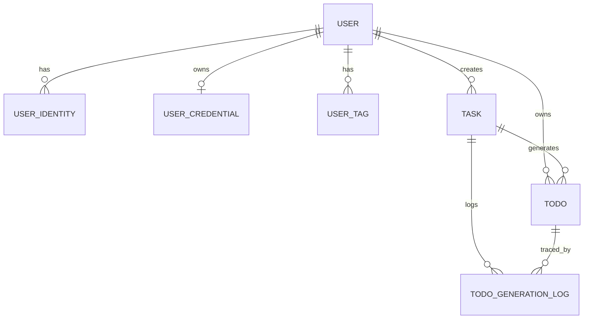
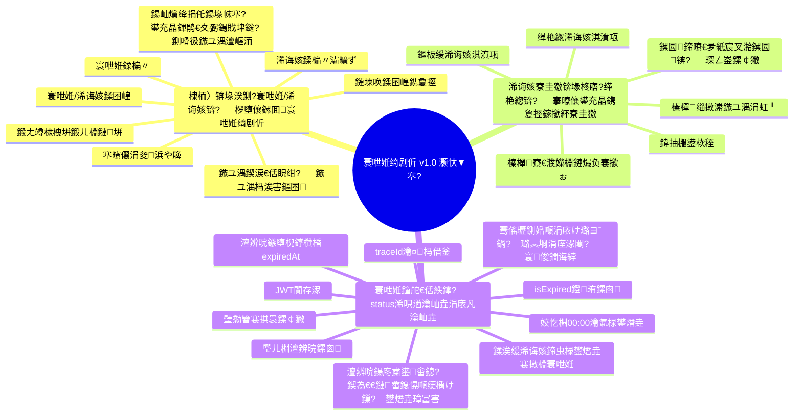

# PRD妯℃澘

# 涓€銆佺増鏈俊鎭?
| **绯荤粺鐗堟湰** | v1 | **鍒涘缓鏃ユ湡** |   | **鎾板啓浜?* | 璋㈠ぉ |
| -------- | -- | -------- | - | ------- | -- |

# 浜屻€佸彉鏇存棩蹇?
| **鏃堕棿** | **鏂囨。鐗堟湰** | **鍙樻洿浜?* | **涓昏鍙樻洿鍐呭** |
| ------ | -------- | ------- | ---------- |
|        | v1       | 璋㈠ぉ      | 鍒涘缓鏂囨。       |

# 涓夈€侀渶姹傛杩?
## 闇€姹傝儗鏅?
姣忓ぉ閮芥湁寰堝闇€瑕佸畬鎴愮殑寰呭姙锛屼絾鏄竴娈垫椂闂磋繃鍘诲悗锛屽苟涓嶇煡閬撹繃鍘诲摢澶╃殑寰呭姙瀹屾垚浜嗭紝鍝ぉ娌″畬鎴愶紝涓嶈繃娓呮櫚鏄庝簡锛屼篃涓嶈兘鐫ｄ績鑷繁瀹屾垚浠诲姟锛屾墍浠ヨ鍒掑紑鍙戜竴涓皬绋嬪簭锛岀敤绋嬪簭绠＄悊鐩爣銆?
## 闇€姹傜洰鏍?
- 璁╃敤鎴峰湪棣栭〉鍗冲彲蹇€熸劅鐭ャ€屼粖澶╄鍋氫粈涔堛€佸仛浜嗗灏戙€佽繕宸灏戙€嶏紝褰㈡垚姣忔棩鎵ц闂幆銆? 
- 璁╃敤鎴峰彲浠ヤ娇鐢ㄥ伐鍏烽殢鏃堕殢鍦版煡鐪嬪緟鍔烇紝瀹屾垚寰呭姙

## 鏂规璇存槑

绠€鍗曟弿杩板疄鐜伴渶姹傜殑浜у搧鏂规

## 鐢ㄦ埛鏁呬簨

| **#** | **鐢ㄦ埛鏁呬簨** | **楠屾敹鏍囧噯** | **浼樺厛绾?* | **鐗堟湰** |
| ----- | -------- | -------- | ------- | ------ |
| US-01 | 浣滀负鐢ㄦ埛锛屾垜甯屾湜棣栭〉榛樿灞曠ず褰撴湀鏃ュ巻骞堕€変腑褰撳ぉ锛屼互渚胯繘鍏ュ嵆鐢ㄣ€?| 棣栨杩涘叆鏄剧ず褰撴湀锛岄粯璁ら€変腑褰撳ぉ锛屾敮鎸佸垏鎹换鎰忔棩鏈熴€?| P0 | v1.0 |
| US-02 | 浣滀负鐢ㄦ埛锛屾垜甯屾湜鏃ュ巻鑳芥竻鏅板尯鍒嗘棩鏈熸墽琛岀粨鏋滐紝浠ヤ究蹇€熷鐩樸€?| 鏃ュ巻鐘舵€佷粎鏈夊洓绫伙細宸插畬鎴?鍘嗗彶鏈畬鎴?褰撴棩鏈畬鎴?鏃犲緟鍔炪€?| P0 | v1.0 |
| US-03 | 浣滀负鐢ㄦ埛锛屾垜甯屾湜鍦ㄩ椤电洿鎺ョ湅鍒伴€変腑鏃ユ湡鐨勫畬鎴愯繘搴︺€?| 鏃ュ巻涓嬫柟鏄剧ず鏂囨锛歚YYYY-MM-DD 宸插畬鎴怷/鍏盰`锛屼笖闅忓嬀閫夊疄鏃跺彉鍖栥€?| P0 | v1.0 |
| US-04 | 浣滀负鐢ㄦ埛锛屾垜甯屾湜鍕鹃€夋寜閽浐瀹氬湪寰呭姙鏈€鍙充晶锛屽苟鏀寔鍙屽悜鍒囨崲銆?| 鐐瑰嚮鍙充晶鍕鹃€夊彲鍦ㄦ湭瀹屾垚/宸插畬鎴愰棿鍒囨崲锛屽垏鎹㈠悗鍒楄〃涓庢棩鍘嗙姸鎬佸疄鏃跺埛鏂般€?| P0 | v1.0 |
| US-05 | 浣滀负鐢ㄦ埛锛屾垜甯屾湜宸插け鏁堝緟鍔炰粛鍙户缁畬鎴愩€?| 寰呭姙璺ㄦ棩鏈畬鎴愯嚜鍔ㄦ爣璁板け鏁堬紱琛ュ畬鎴愬悗 `isExpired=false`銆?| P0 | v1.0 |
| US-06 | 浣滀负鐢ㄦ埛锛屾垜甯屾湜鍙湪棣栭〉瀹屾垚澶嶇洏锛屼笉闇€瑕佸崟鐙巻鍙查〉銆?| 鐐瑰嚮鍘嗗彶鏃ユ湡鍗冲彲鏌ョ湅褰撴棩寰呭姙锛屼笉鎻愪緵鐙珛鍘嗗彶寰呭姙椤甸潰銆?| P0 | v1.0 |
| US-07 | 浣滀负鐢ㄦ埛锛屾垜甯屾湜鏂板浠诲姟閫氳繃寮圭獥瀹屾垚锛岄伩鍏嶉〉闈㈣烦杞墦鏂€?| 鐐瑰嚮搴曢儴鍙充晶鈥?鈥濇墦寮€浠诲姟寮圭獥锛岃嚜鍔ㄨ仛鐒︽爣棰樿緭鍏ユ锛涢粯璁ゅ紑濮嬫棩鏈熶负褰撳ぉ锛岀粨鏉熸棩鏈熺暀绌哄嵆闀挎湡鏈夋晥銆?| P0 | v1.0 |
| US-08 | 浣滀负鐢ㄦ埛锛屾垜甯屾湜閫氳繃宸︽粦蹇€熷垹闄ゅ緟鍔烇紝鍑忓皯澶氫綑鎿嶄綔銆?| 寰呭姙椤瑰乏婊戝悗灞曠ず鍒犻櫎鎸夐挳锛涚偣鍑诲垹闄ゅ悗寰呭姙琚蒋鍒犻櫎锛屽垪琛ㄤ笌鏃ュ巻鐘舵€佸悓姝ュ埛鏂般€?| P0 | v1.0 |
| US-09 | 浣滀负鐢ㄦ埛锛屾垜甯屾湜鍒犻櫎缁撴灉鎻愮ず鍑虹幇鍦ㄩ〉闈㈤《閮ㄤ笖涓嶉噸澶嶉棯鍔ㄣ€?| 鍒犻櫎鎴愬姛/澶辫触鍚庢樉绀洪《閮ㄨ交鎷熺墿 Toast锛涘悓鏂囨鍦ㄧ煭鏃堕棿鍐呰Е鍙戦渶闃叉姈锛岄伩鍏嶉噸澶嶆縺娲汇€?| P0 | v1.0 |
| US-10 | 浣滀负鐢ㄦ埛锛屾垜甯屾湜浠诲姟鍙叧鑱斿崟涓爣绛惧苟浼犻€掑埌寰呭姙锛屼究浜庢寜绫诲鐞嗐€?| 浠诲姟寮圭獥鍙粠宸叉湁鏍囩鍗曢€夛紱浠诲姟鐢熸垚寰呭姙鍚庝笅娌?`tagId/tagName`锛涘悓鏍囩寰呭姙鍦ㄥ垪琛ㄤ腑鐩搁偦灞曠ず銆?| P0 | v1.0 |
| US-11 | 浣滀负鐢ㄦ埛锛屾垜甯屾湜棣栭〉搴曢儴鍙垏鎹⑩€滃緟鍔?浠诲姟鈥濓紝骞朵繚鐣欏揩鎹峰垱寤哄叆鍙ｃ€?| 搴曢儴閲囩敤宸?涓?鍙充笁娈碉細鑿滃崟鍏ュ彛銆佸緟鍔?浠诲姟鍒囨崲銆?鏂板缓浠诲姟锛涗腑闂存敮鎸佺偣鍑讳笌灞€閮ㄥ乏鍙虫粦鍔ㄥ垏鎹€?| P0 | v1.0 |
| US-12 | 浣滀负鐢ㄦ埛锛屾垜甯屾湜鍦ㄦ爣绛剧鐞嗛〉缁存姢鏍囩锛屼究浜庡悗缁换鍔″鐢ㄣ€?| 鑿滃崟鍙繘鍏ユ爣绛剧鐞嗛〉锛涙敮鎸佸彸涓嬭鏂板銆佸脊绐楃紪杈戙€佸乏婊戝垹闄わ紱鑻ユ爣绛捐浠诲姟寮曠敤鍒欑姝㈠垹闄ゅ苟鎻愮ず銆?| P0 | v1.0 |
| US-13 | 浣滀负鐢ㄦ埛锛屾垜甯屾湜浠诲姟鎸夊懆鍑犻噸澶嶏紝浠ヤ究鍙湪鎸囧畾鏃ユ湡鐢熸垚寰呭姙銆?| 浠诲姟寮圭獥鍙閫夊懆涓€鑷冲懆鏃ワ紱涓嶉€夋椂浠呭垱寤哄綋娆＄敓鎴愪竴娆″緟鍔烇紝鍚庣画涓嶈嚜鍔ㄧ敓鎴愩€?| P0 | v1.0 |
| US-14 | 浣滀负鐢ㄦ埛锛屾垜甯屾湜浠诲姟鏀寔蹇嵎缂栬緫锛屾彁鍗囦换鍔＄淮鎶ゆ晥鐜囥€?| 浠诲姟椤瑰乏婊戝悗灞曠ず缂栬緫涓庡垹闄ゆ寜閽紙缂栬緫鍦ㄥ垹闄ゅ乏渚э級锛涚偣鍑荤紪杈戞寜閽垨浠诲姟鍗＄墖鍧囧彲鎵撳紑缂栬緫寮圭獥骞跺洖濉繚瀛樸€?| P0 | v1.0 |

## 绯荤粺瑙勫垝

| **鐗堟湰** | **鍔熻兘** | **棰勮涓婄嚎鏃ユ湡** |
| ------ | ------ | :--------- |
| v1.0锛堢涓€闃舵锛?| 灏忕▼搴忥細棣栭〉锛堟湀鍘?寰呭姙/浠诲姟鍒囨崲锛?浠诲姟寮圭獥锛堟柊寤?缂栬緫锛夛紝鏀寔寰呭姙鍙屽悜鍕鹃€夈€佸緟鍔炲乏婊戝垹闄ゃ€佷换鍔″乏婊戠紪杈?鍒犻櫎銆佷换鍔″垪琛ㄦ祻瑙堛€佹棩鍒囧け鏁堛€佹棩鍘嗗洓鎬?| TBD |
| v1.1锛堢浜岄樁娈碉級 | 閫氱煡鍔熻兘锛堝緟鍔炴彁閱掋€佹湭瀹屾垚鎻愰啋銆佹彁閱掑紑鍏充笌鏃堕棿閰嶇疆锛?| TBD |
| v1.2锛堢涓夐樁娈碉級 | AI鎬荤粨鍔熻兘锛堟棩鎶?鍛ㄦ姤/鏈堟姤锛屽畬鎴愮巼涓庢墽琛岃秼鍔垮垎鏋愶級 | TBD |
| v1.3锛堢鍥涢樁娈碉級 | 鍏朵粬瀹㈡埛绔?| TBD |

# 鍥涖€佹暣浣撹鏄?
## 涓氬姟鏈

| **绫诲瀷** | **鏈** | **璇存槑** |
| ------ | ------ | :----- |
| 涓氬姟姒傚康 | 浠诲姟锛圱ask锛?| 鐢ㄦ埛瀹氫箟鐨勮鍒掕鍒欏疄浣擄紝鍐冲畾鍦ㄤ粈涔堟椂闂磋寖鍥村唴鐢熸垚寰呭姙銆?|
| 涓氬姟姒傚康 | 寰呭姙锛圱odo锛?| 姣忔棩鎵ц鐨勫叿浣撲簨椤癸紝鐢变换鍔＄敓鎴愭垨鍗虫椂鐢熸垚銆?|
| 涓氬姟姒傚康 | 鐢熸晥鑼冨洿 | 浠诲姟鍙敓鎴愬緟鍔炵殑鏃ユ湡鍖洪棿锛堝紑濮?缁撴潫鏃ユ湡锛夈€?|
| 涓氬姟姒傚康 | 鏃ュ巻鐘舵€?| 鏌愭棩鏈熺殑瀹屾垚鐘舵€侊細宸插畬鎴?鍘嗗彶鏈畬鎴?褰撴棩鏈畬鎴?鏃犲緟鍔炪€?|
| 涓氬姟姒傚康 | 0鐐规棩鍒?| 姣忔棩 00:00 鐢变簯鍑芥暟瀹氭椂瑙﹀彂鍣紙config.json triggers锛宑ron: `0 0 0 * * * *`锛夎嚜鍔ㄦ墽琛?鐢熸垚褰撳ぉ寰呭姙+鏍囪鍘嗗彶鏈畬鎴愪负宸插け鏁?鐨勬壒澶勭悊鏈哄埗锛屾棤闇€ HTTP 閴存潈銆?|
| 涓氬姟姒傚康 | 琛ュ伩鐢熸垚 | 0鐐圭敓鎴愬け璐ュ悗锛屾寜鏃ュ織杩涜琛ヨ窇鐢熸垚銆?|
| 涓氬姟姒傚康 | 杞垹闄?| 鏍囪鍒犻櫎锛屼笉鐗╃悊绉婚櫎鏁版嵁锛屽巻鍙插彲杩芥函銆?|
| 绯荤粺姒傚康 | 鐢ㄦ埛锛圲ser锛?| 涓氬姟涓荤敤鎴峰疄浣擄紝鎵€鏈変换鍔′笌寰呭姙褰掑睘鍒?userId銆?|
| 绯荤粺姒傚康 | 韬唤鏄犲皠锛圲serIdentity锛?| 澶栭儴鐧诲綍韬唤涓?userId 鐨勬槧灏勫叧绯汇€?|
| 绯荤粺姒傚康 | 鍑瘉锛圲serCredential锛?| 璐﹀彿瀵嗙爜鐧诲綍鍦烘櫙涓嬬殑瀵嗙爜鍝堝笇涓庡畨鍏ㄧ姸鎬併€?|
| 绯荤粺姒傚康 | 鏍囩锛圲serTag锛?| 鐢ㄦ埛鍙€夋爣绛句富鏁版嵁锛屾敮鎸佸湪鏍囩绠＄悊椤靛鍒犳敼骞朵緵浠诲姟寮圭獥鍗曢€夈€?|
| 绯荤粺姒傚康 | 骞傜瓑閿?| 鍞竴绾︽潫 `(userId, taskId, todoDate)`锛岄槻閲嶅鐢熸垚銆?|
| 绯荤粺姒傚康 | JWT | 鏈嶅姟绔鍙戠殑璁块棶浠ょ墝锛岀敤浜庢帴鍙ｉ壌鏉冦€?|
| 绯荤粺姒傚康 | TraceId | 璇锋眰閾捐矾杩借釜鏍囪瘑锛岀敤浜庢棩蹇楁帓闅溿€?|

## 鏉冮檺璁捐

### 瑙掕壊瀹氫箟

- 鏅€氱敤鎴凤細鍙鐞嗚嚜宸辩殑浠诲姟涓庡緟鍔烇紝鏌ョ湅鑷繁鐨勬棩鍘嗕笌缁熻銆? 
- 绯荤粺绠＄悊鍛橈紙棰勭暀锛夛細浠呯敤浜庣郴缁熺淮鎶や笌瀹¤锛屼笉鍙備笌鏅€氫笟鍔℃搷浣溿€? 

### 璧勬簮涓庡姩浣滄潈闄?
| 瑙掕壊 | 璧勬簮 | 鍔ㄤ綔 | 鏉冮檺瑙勫垯 |
| :-- | :-- | :-- | :-- |
| 鏅€氱敤鎴?| task | 鍒涘缓/鏌ヨ/淇敼/鍒犻櫎 | 浠呭彲鎿嶄綔 `userId=鏈汉` 鐨勪换鍔?|
| 鏅€氱敤鎴?| todo | 鏌ヨ/鐘舵€佸垏鎹?| 浠呭彲鎿嶄綔 `userId=鏈汉` 鐨勫緟鍔?|
| 鏅€氱敤鎴?| user_tag | 鏌ヨ/鍒涘缓/淇敼/鍒犻櫎 | 浠呭彲绠＄悊鏈汉鏍囩锛涜浠诲姟寮曠敤鐨勬爣绛剧姝㈠垹闄?|
| 鏅€氱敤鎴?| 鏃ュ巻缁熻 | 鏌ヨ | 浠呭彲鏌ョ湅 `userId=鏈汉` 鐨勭粺璁＄粨鏋?|
| 鏅€氱敤鎴?| user_profile | 鏌ヨ/淇敼 | 浠呭彲淇敼鏈汉鏄电О銆佸ご鍍忕瓑闈炴晱鎰熶俊鎭?|
| 鏅€氱敤鎴?| user_identity/user_credential | 鏌ヨ锛堝彈闄愶級 | 浠呭厑璁告煡鐪嬭劚鏁忓悗鐨勭櫥褰曟柟寮忎俊鎭?|
| 绯荤粺绠＄悊鍛?| 瀹¤鏃ュ織 | 鏌ヨ | 浠呯敤浜庢晠闅滄帓鏌ヤ笌瀹¤锛岀姝慨鏀逛笟鍔℃暟鎹?|

### 鏉冮檺鎺у埗瑙勫垯

- 鎵€鏈夋帴鍙ｅ繀椤诲厛閴存潈锛圝WT锛夛紝鍐嶅仛璧勬簮褰掑睘鏍￠獙锛坄resource.userId == token.userId`锛夈€? 
- 鍓嶇闅愯棌鎸夐挳涓嶇瓑浜庢潈闄愭帶鍒讹紝鍚庣蹇呴』寮烘牎楠屻€? 
- 瀵硅法鐢ㄦ埛璁块棶缁熶竴杩斿洖 403銆? 

## 娴佺▼璇存槑

### 鏂囧瓧娴佺▼

1. 鐢ㄦ埛鐧诲綍鍚庤繘鍏ラ椤碉紝榛樿灞曠ず褰撴湀鏃ュ巻骞堕€変腑褰撳ぉ锛岄粯璁よ鍥句负鈥滃緟鍔炩€濄€? 
2. 鐢ㄦ埛鍙€氳繃搴曢儴涓棿鍒囨崲鎺т欢锛堢偣鍑绘垨灞€閮ㄥ乏鍙虫粦鍔級鍦ㄢ€滃緟鍔?浠诲姟鈥濅箣闂村垏鎹€? 
3. 鐢ㄦ埛鐐瑰嚮搴曢儴鍙充晶鈥?鈥濇墦寮€浠诲姟寮圭獥锛岄粯璁ゅ紑濮嬫棩鏈熶负褰撳ぉ锛岀粨鏉熸棩鏈熺暀绌哄嵆闀挎湡鏈夋晥銆? 
4. 鐢ㄦ埛淇濆瓨浠诲姟鏃讹紝鑻ュ綋澶╁湪浠诲姟鐢熸晥鑼冨洿鍐咃紝绯荤粺绔嬪嵆鐢熸垚褰撳ぉ寰呭姙锛涗换鍔￠〉鍙煡鐪嬪凡鍒涘缓浠诲姟鍒楄〃銆? 
5. 鐢ㄦ埛鍦ㄥ緟鍔炶鍥剧偣鍑绘煇鏃ユ湡鍚庯紝绯荤粺鎷夊彇璇ユ棩鏈熷緟鍔烇紝骞跺睍绀?`宸插畬鎴怷/鍏盰` 杩涘害銆? 
6. 鐢ㄦ埛鐐瑰嚮寰呭姙鏈€鍙充晶鍕鹃€夋寜閽彲鍙屽悜鍒囨崲鐘舵€侊細鏈畬鎴愨啍宸插畬鎴愩€? 
7. 姣忓ぉ 00:00 鎵ц鏃ュ垏浠诲姟锛氱敓鎴愬綋澶╁緟鍔烇紝骞跺皢鏄ㄦ棩鍙婃洿鏃╂湭瀹屾垚寰呭姙鏍囪涓哄け鏁堬紱鑻ュ畾鏃舵紡璺戯紝棣栭〉寰呭姙瑙嗗浘鍔犺浇鏃舵寜褰撳墠鐢ㄦ埛琛ュ伩鐢熸垚褰撴棩寰呭姙銆? 
8. 鍘嗗彶鏃ユ湡澶嶇洏鍦ㄩ椤靛唴瀹屾垚锛屼笉鎻愪緵鐙珛鍘嗗彶寰呭姙椤甸潰銆? 

### Mermaid娴佺▼鍥?
```mermaid
flowchart TD
  A[鐢ㄦ埛鐧诲綍] --> B[杩涘叆棣栭〉骞跺姞杞藉綋鏈堟棩鍘哴
  B --> C[搴曢儴涓棿鍒囨崲寰呭姙/浠诲姟]
  C --> H[灞曠ず閫変腑鏃ユ湡寰呭姙涓庤繘搴
  C --> P[灞曠ず浠诲姟鍒楄〃]
  H --> I[鐐瑰嚮鏃ユ湡鍒囨崲寰呭姙鍒楄〃]
  I --> H
  H --> J[鐐瑰嚮鏈€鍙充晶鍕鹃€夋寜閽甝
  J --> K{鐘舵€佸垏鎹
  K -- 鏈畬鎴?>宸插畬鎴?--> L[鍐檆ompletedAt骞剁疆isExpired=false]
  K -- 宸插畬鎴?>鏈畬鎴?--> M[娓卌ompletedAt骞堕噸绠梚sExpired]
  L --> H
  M --> H
  B --> D[鐐瑰嚮搴曢儴鍙充晶+]
  D --> E[鎵撳紑浠诲姟寮圭獥骞跺～鍐欒〃鍗昡
  E --> F{浠婂ぉ鏄惁鍦ㄧ敓鏁堣寖鍥村唴?}
  F -- 鏄?--> G[绔嬪嵆鐢熸垚浠婂ぉ寰呭姙]
  F -- 鍚?--> Q[浠呬繚瀛樹换鍔¤鍒橾
  G --> H
  Q --> P
  N[姣忔棩00:00鏃ュ垏浠诲姟] --> O[鐢熸垚褰撳ぉ寰呭姙骞舵爣璁板巻鍙叉湭瀹屾垚涓哄け鏁圿
  O --> H
```

## 瀹炰綋鍏崇郴



## 鏁版嵁缁撴瀯

### 瀹炰綋涓€锛歶ser锛堢敤鎴峰疄浣擄級

| 瀛楁鍚?| 鏁版嵁绫诲瀷 | 蹇呭～ | 璇存槑 |
| :-- | :--- | :- | :- |
| _id | string | 鏄?| 鐢ㄦ埛ID锛堜笟鍔′富閿級 |
| nickname | string | 鍚?| 鏄电О |
| avatarUrl | string | 鍚?| 澶村儚鍦板潃 |
| status | number | 鏄?| 1=姝ｅ父锛?=绂佺敤 |
| lastLoginAt | number | 鍚?| 鏈€杩戠櫥褰曟椂闂存埑锛堟绉掞級 |
| createdAt | number | 鏄?| 鍒涘缓鏃堕棿鎴筹紙姣锛?|
| updatedAt | number | 鏄?| 鏇存柊鏃堕棿鎴筹紙姣锛?|

### 瀹炰綋浜岋細user_identity锛堢敤鎴疯韩浠芥槧灏勶級

| 瀛楁鍚?| 鏁版嵁绫诲瀷 | 蹇呭～ | 璇存槑 |
| :-- | :--- | :- | :- |
| _id | string | 鏄?| 鏄犲皠ID |
| userId | string | 鏄?| 鍏宠仈鐢ㄦ埛ID锛堝搴?user._id锛?|
| provider | string | 鏄?| 韬唤鏉ユ簮锛坵echat_miniprogram/password/web/electron锛?|
| identityKey | string | 鏄?| 閫氱敤韬唤鍞竴鏍囪瘑锛堝皬绋嬪簭=openid锛屽瘑鐮佺櫥褰?鏍囧噯鍖栬处鍙凤級 |
| openid | string | 鍚?| 寰俊openid锛堜粎 provider=wechat_miniprogram 鏃舵湁鍊硷級 |
| unionid | string | 鍚?| 寰俊unionid锛堝悓涓讳綋澶氬簲鐢ㄧ粺涓€鏍囪瘑锛?|
| createdAt | number | 鏄?| 鍒涘缓鏃堕棿鎴筹紙姣锛?|
| updatedAt | number | 鏄?| 鏇存柊鏃堕棿鎴筹紙姣锛?|

### 瀹炰綋涓夛細user_credential锛堣处鍙峰瘑鐮佸嚟璇侊級

| 瀛楁鍚?| 鏁版嵁绫诲瀷 | 蹇呭～ | 璇存槑 |
| :-- | :--- | :- | :- |
| _id | string | 鏄?| 鍑瘉ID |
| userId | string | 鏄?| 鍏宠仈鐢ㄦ埛ID锛堝搴?user._id锛?|
| passwordHash | string | 鏄?| 瀵嗙爜鍝堝笇锛堢姝㈡槑鏂囧瓨鍌級 |
| passwordAlgo | string | 鏄?| 鍝堝笇绠楁硶鏍囪瘑锛堝 argon2id锛?|
| passwordUpdatedAt | number | 鏄?| 瀵嗙爜鏇存柊鏃堕棿鎴筹紙姣锛?|
| failedLoginCount | number | 鏄?| 杩炵画澶辫触娆℃暟 |
| lockUntil | number | 鍚?| 閿佸畾鎴鏃堕棿鎴筹紙姣锛?|
| createdAt | number | 鏄?| 鍒涘缓鏃堕棿鎴筹紙姣锛?|
| updatedAt | number | 鏄?| 鏇存柊鏃堕棿鎴筹紙姣锛?|

### 瀹炰綋鍥涳細user_tag锛堟爣绛句富鏁版嵁锛?
| 瀛楁鍚?| 鏁版嵁绫诲瀷 | 蹇呭～ | 璇存槑 |
| :-- | :--- | :- | :- |
| _id | string | 鏄?| 鏍囩ID |
| userId | string | 鏄?| 鐢ㄦ埛ID |
| name | string | 鏄?| 鏍囩鍚嶇О锛堢敤鎴峰唴鍞竴锛?|
| sort | number | 鍚?| 鎺掑簭鏉冮噸锛堣秺灏忚秺闈犲墠锛?|
| isDeleted | boolean | 鏄?| 杞垹闄ゆ爣璁?|
| createdAt | number | 鏄?| 鍒涘缓鏃堕棿鎴筹紙姣锛?|
| updatedAt | number | 鏄?| 鏇存柊鏃堕棿鎴筹紙姣锛?|

### 瀹炰綋浜旓細task锛堜换鍔″疄浣擄級

| 瀛楁鍚?| 鏁版嵁绫诲瀷 | 蹇呭～ | 璇存槑 |
| :-- | :--- | :- | :- |
| _id | string | 鏄?| 浠诲姟ID |
| userId | string | 鏄?| 鐢ㄦ埛ID |
| title | string | 鏄?| 浠诲姟鏍囬 |
| remark | string | 鍚?| 澶囨敞璇存槑 |
| tagId | string | 鍚?| 鏍囩ID锛堝叧鑱?user_tag._id锛?|
| tagName | string | 鍚?| 鏍囩鍚嶇О蹇収 |
| effectiveStartDate | string(date) | 鏄?| 鐢熸晥寮€濮嬫棩鏈燂紙yyyy-MM-dd锛?|
| effectiveEndDate | string(date) | 鍚?| 鐢熸晥缁撴潫鏃ユ湡锛坹yyy-MM-dd锛屼负绌鸿〃绀洪暱鏈熸湁鏁堬級 |
| repeatRule | object | 鏄?| 閲嶅瑙勫垯锛堝浐瀹?`weekly`锛宍weekdays` 瀛樺偍鍛ㄤ竴鑷冲懆鏃ュ搴?1-7锛?|
| status | number | 鏄?| 1=鍚敤锛?=鍋滅敤 |
| isDeleted | boolean | 鏄?| 杞垹闄ゆ爣璁?|
| version | number | 鏄?| 浠诲姟鐗堟湰鍙凤紝缂栬緫鍚庨€掑 |
| createdAt | number | 鏄?| 鍒涘缓鏃堕棿鎴筹紙姣锛?|
| updatedAt | number | 鏄?| 鏇存柊鏃堕棿鎴筹紙姣锛?|
| deletedAt | number | 鍚?| 鍒犻櫎鏃堕棿鎴筹紙姣锛?|

### 瀹炰綋鍏細todo锛堝緟鍔炲疄渚嬶級

| 瀛楁鍚?| 鏁版嵁绫诲瀷 | 蹇呭～ | 璇存槑 |
| :-- | :--- | :- | :- |
| _id | string | 鏄?| 寰呭姙ID |
| userId | string | 鏄?| 鐢ㄦ埛ID |
| taskId | string | 鏄?| 鏉ユ簮浠诲姟ID |
| taskVersion | number | 鏄?| 鐢熸垚鏃朵换鍔＄増鏈彿 |
| todoDate | string(date) | 鏄?| 寰呭姙鎵€灞炴棩鏈燂紙yyyy-MM-dd锛?|
| triggerType | string | 鏄?| 瑙﹀彂绫诲瀷锛坈reate_task/cron_0000/retry锛?|
| title | string | 鏄?| 寰呭姙鏍囬锛堜粠浠诲姟蹇収涓嬫矇锛?|
| tagId | string | 鍚?| 鏍囩ID蹇収 |
| tagName | string | 鍚?| 鏍囩鍚嶇О蹇収 |
| completedAt | number | 鍚?| 瀹屾垚鏃堕棿鎴筹紙姣锛?|
| status | number | 鏄?| 1=鏈畬鎴愶紝2=宸插畬鎴?|
| isExpired | boolean | 鏄?| 鏄惁澶辨晥锛坱rue=宸插け鏁堬紝false=鏈け鏁堬級 |
| expiredAt | number | 鍚?| 棣栨澶辨晥鏃堕棿鎴筹紙姣锛?|
| isDeleted | boolean | 鏄?| 杞垹闄ゆ爣璁?|
| createdAt | number | 鏄?| 鍒涘缓鏃堕棿鎴筹紙姣锛?|
| updatedAt | number | 鏄?| 鏇存柊鏃堕棿鎴筹紙姣锛?|
| deletedAt | number | 鍚?| 鍒犻櫎鏃堕棿鎴筹紙姣锛?|

### 瀹炰綋涓冿細todo_generation_log锛堝緟鍔炵敓鎴愭棩蹇楋級

| 瀛楁鍚?| 鏁版嵁绫诲瀷 | 蹇呭～ | 璇存槑 |
| :-- | :--- | :- | :- |
| _id | string | 鏄?| 鏃ュ織ID |
| userId | string | 鏄?| 鐢ㄦ埛ID |
| taskId | string | 鏄?| 浠诲姟ID |
| todoDate | string(date) | 鏄?| 鐩爣鐢熸垚鏃ユ湡锛坹yyy-MM-dd锛?|
| triggerType | string | 鏄?| 瑙﹀彂绫诲瀷锛坈reate_task/cron_0000/retry锛?|
| result | string | 鏄?| 鎵ц缁撴灉锛坰uccess/skipped_duplicate/failed锛?|
| todoId | string | 鍚?| 鎴愬姛鐢熸垚鏃跺搴斿緟鍔濱D |
| errorCode | string | 鍚?| 澶辫触閿欒鐮?|
| errorMessage | string | 鍚?| 澶辫触淇℃伅 |
| traceId | string | 鍚?| 閾捐矾杩借釜ID |
| createdAt | number | 鏄?| 鍒涘缓鏃堕棿鎴筹紙姣锛?|

### 鐢ㄦ埛涓庤韩浠藉叧鑱斿叧绯?
- `user` 涓?`user_identity` 涓轰竴瀵瑰鍏崇郴锛氫竴涓敤鎴峰彲缁戝畾澶氫釜韬唤鏉ユ簮銆? 
- `user` 涓?`user_credential` 涓轰竴瀵逛竴锛堝彲閫夛級鍏崇郴锛氫粎褰撳瓨鍦ㄨ处鍙峰瘑鐮佺櫥褰曟椂鎵嶆湁璁板綍銆? 
- 鐧诲綍璇嗗埆娴佺▼锛堝皬绋嬪簭锛夛細`wx.login(code)` -> 鏈嶅姟绔崲鍙?`openid` -> 鏌?`user_identity(provider, identityKey)` -> 瀹氫綅 `userId` -> 绛惧彂 JWT銆? 
- 鐧诲綍璇嗗埆娴佺▼锛堣处鍙峰瘑鐮侊級锛氭湇鍔＄鍏堟寜璐﹀彿鏌?`user_identity(provider=password, identityKey=鏍囧噯鍖栬处鍙?` -> 鍐嶆牎楠?`user_credential.passwordHash` -> 鎴愬姛鍚庣鍙?JWT銆? 

### 鍏抽敭绾︽潫涓庤鍒?
- 鍒涘缓浠诲姟鏃讹紝鑻ュ綋澶╁湪浠诲姟鐢熸晥鑼冨洿鍐咃紝绔嬪嵆鐢熸垚褰撳ぉ寰呭姙銆? 
- 姣忓ぉ 0 鐐规墽琛屾棩鍒囦换鍔★細涓虹敓鏁堜腑鐨勪换鍔＄敓鎴愬綋澶╁緟鍔烇紝骞跺皢鏄ㄦ棩鍙婃洿鏃?`status=1(鏈畬鎴?` 鐨勫緟鍔炴壒閲忔爣璁颁负 `isExpired=true`锛屽悓鏃跺啓鍏?`expiredAt`锛堜粎棣栨鍐欏叆锛夈€? 
- 棣栭〉寰呭姙瑙嗗浘鍔犺浇鏃讹紝鎸夊綋鍓嶇敤鎴锋墽琛屸€滃綋鏃ヨˉ鍋跨敓鎴愨€濓細浠呰ˉ榻愬綋鏃ュ簲鐢熸垚浣嗙己澶辩殑寰呭姙锛岄噸澶嶈Е鍙戜繚鎸佸箓绛夈€? 
- 宸插け鏁堝緟鍔炰粛鍏佽鐢ㄦ埛缁х画瀹屾垚锛涘畬鎴愬悗鏇存柊 `status=2(宸插畬鎴?`銆佽褰?`completedAt`锛屽苟灏?`isExpired=false`銆? 
- 宸插畬鎴愬緟鍔炴敮鎸佸啀娆″嬀閫夊洖閫€涓烘湭瀹屾垚锛涘洖閫€鏃舵竻绌?`completedAt` 骞舵寜寰呭姙鎵€灞炴棩鏈熼噸绠?`isExpired`銆?- 寰呭姙鐘舵€佸垏鎹㈤噰鐢ㄤ箰瑙傛洿鏂版満鍒讹細鍓嶇绔嬪嵆鏇存柊 UI 骞堕噸绠楄繘搴︼紝鍚庡彴璋冪敤 API锛涙垚鍔熷悗闈欓粯鍒锋柊鏈嶅姟绔暟鎹紝澶辫触鏃跺洖婊氬埌涔嬪墠鐘舵€佸苟鎻愮ず"鎿嶄綔澶辫触"銆?- `expiredAt` 鐢ㄤ簬淇濈暀鈥滄浘澶辨晥鈥濈殑鍘嗗彶鐥曡抗锛屼笉鍥犲畬鎴愬姩浣滄竻绌恒€? 
- 浠诲姟鏍囩浠呮敮鎸佸崟閫夛紝鏍囩鏉ユ簮浜?`user_tag`锛涗换鍔′繚瀛樻椂鍐欏叆 `tagId/tagName`銆? 
- 浠诲姟閲嶅瑙勫垯閲囩敤 `repeatRule.type=weekly` + `repeatRule.weekdays`锛?=鍛ㄤ竴...7=鍛ㄦ棩锛夈€? 
- `repeatRule.weekdays=[]` 瑙嗕负涓嶉噸澶嶏細浠呭垱寤轰换鍔″綋娆″彲鐢熸垚涓€娆″緟鍔烇紝鍚庣画涓嶈嚜鍔ㄧ敓鎴愩€? 
- `repeatRule.weekdays` 闈炵┖鏃讹紝浠呭湪鍛戒腑鏄熸湡鍑犵殑鏃ユ湡鐢熸垚寰呭姙銆? 
- 寰呭姙鐢熸垚鏃朵笅娌変换鍔℃爣绛惧揩鐓э細`todo.tagId/todo.tagName`銆? 
- 鏍囩鍚嶇О缂栬緫鍚庯紝鍚屾鍥炲啓鏈汉鏈垹闄ょ殑浠诲姟涓庡緟鍔?`tagName`锛屼繚鎸佸睍绀轰竴鑷淬€? 
- 鏍囩鍒犻櫎鍓嶉渶鏍￠獙浠诲姟寮曠敤锛涜嫢瀛樺湪鏈垹闄や换鍔″紩鐢ㄨ鏍囩锛屽垹闄よ鎷掔粷骞惰繑鍥炴槑纭彁绀恒€? 
- 缂栬緫浠诲姟鍚庯細  
  - 鍚屾鏇存柊褰撳ぉ銆屾湭瀹屾垚銆嶅緟鍔烇紱  
  - 褰撳ぉ銆屽凡瀹屾垚銆嶅緟鍔炰笉鍋氫慨鏀癸紱  
  - 鏈潵寰呭姙鎸夋柊浠诲姟瑙勫垯鍦ㄥ悗缁?0 鐐圭敓鎴愩€? 
- 鍒犻櫎浠诲姟浠呰蒋鍒犻櫎 `task`锛屼笉褰卞搷宸茬敓鎴愬緟鍔炲巻鍙层€? 
- 寰呭姙骞傜瓑鍞竴閿細`(userId, taskId, todoDate)`锛岄槻姝㈤噸澶嶇敓鎴愩€? 
- 寰呭姙鍒楄〃鎺掑簭鍙ｅ緞锛氬悓鏍囩寰呭姙鑱氬悎灞曠ず锛堟寜 `tagName`锛夛紝鏃犳爣绛惧緟鍔炴帓鍦ㄦ渶鍚庯紝缁勫唴鎸?`createdAt` 鍗囧簭銆? 
- 鏃ュ巻鐘舵€佽绠楀彛寰勶細  
  - `uncompletedCount` 瀹氫箟涓?`status=1(鏈畬鎴?` 鐨勫緟鍔炴暟閲忥紙鍖呭惈 `isExpired=true/false`锛夛紱  
  - 鏃犲緟鍔烇細`todoCount=0`锛? 
  - 宸插畬鎴愶細`completedCount=todoCount 涓?todoCount>0`锛? 
  - 褰撴棩鏈畬鎴愶細`targetDate=today 涓?uncompletedCount>0`锛? 
  - 鍘嗗彶鏈畬鎴愶細`targetDate<today 涓?uncompletedCount>0`銆? 

### 绱㈠紩寤鸿

- `user`锛歚(status)`  
- `user_identity`锛氬敮涓€绱㈠紩 `(provider, identityKey)`銆乣(userId)`  
- `user_credential`锛氬敮涓€绱㈠紩 `(userId)`  
- `user_tag`锛氬敮涓€绱㈠紩 `(userId, name)`銆乣(userId, sort)`  
- `task`锛歚(userId, isDeleted, status)`銆乣(userId, effectiveStartDate, effectiveEndDate)`  
- `todo`锛歚(userId, todoDate)`銆乣(userId, todoDate, status)`銆乣(userId, todoDate, tagName, createdAt)`銆佸敮涓€绱㈠紩 `(userId, taskId, todoDate)`  
- `todo_generation_log`锛歚(userId, todoDate)`銆乣(taskId, todoDate)`  

## 鍔熻兘缁撴瀯



## 鍔熻兘娓呭崟

閫氳繃浼樺厛绾у尯鍒嗗紑鍙戦『搴忥紝鍔熻兘鎻忚堪鎸夆€滈椤?+ 浠诲姟寮圭獥 + 璋冨害瑙勫垯鈥濈粍缁囥€?
| **涓€绾фā鍧?* | **浜岀骇妯″潡** | **鍔熻兘** | **鍔熻兘鎻忚堪** | **浼樺厛绾?* | **鐘舵€?* |
| -------- | -------- | ------ | -------- | ------- | :----- |
| 棣栭〉 | 椤甸潰妗嗘灦 | 鍗曢〉鎵胯浇涓绘祦绋?| 棣栭〉鍚屾椂鎵胯浇鏃ュ巻娴忚銆佸緟鍔炴墽琛屻€佸巻鍙插鐩橈紝涓嶆柊澧炵嫭绔嬪巻鍙查〉 | P0 | 鏈湡 |
| 棣栭〉 | 搴曢儴瀵艰埅 | 涓夋甯冨眬 | 搴曢儴鍥哄畾宸?涓?鍙充笁娈碉細鑿滃崟鍏ュ彛銆佸緟鍔?浠诲姟鍒囨崲銆?鏂板缓浠诲姟 | P0 | 鏈湡 |
| 棣栭〉 | 瑙嗗浘鍒囨崲 | 寰呭姙/浠诲姟鍒囨崲 | 涓棿鍒囨崲鎺т欢鏀寔鐐瑰嚮涓庡眬閮ㄥ乏鍙虫粦鍔紝榛樿寰呭姙瑙嗗浘 | P0 | 鏈湡 |
| 棣栭〉 | 椤堕儴鍖哄煙 | 鏍囬灞曠ず | 椤堕儴浠呮樉绀衡€滃緟鍔炵簿鐏碘€濓紝涓嶅睍绀哄彛鍙锋枃妗?| P0 | 鏈湡 |
| 棣栭〉 | 鏃ュ巻鍖哄煙 | 鏈堜唤鍒囨崲 | 閫氳繃宸﹀彸鎸夐挳鍒囨崲鏈堜唤骞跺埛鏂拌鏈堢姸鎬?| P0 | 鏈湡 |
| 棣栭〉 | 鏃ュ巻鍖哄煙 | 鍛ㄨ捣濮嬭鍒?| 鏃ュ巻鎸夊懆涓€鍒板懆鏃ュ睍绀猴紝鍛ㄦ棩浣嶄簬鏈€鍚庝竴鍒?| P0 | 鏈湡 |
| 棣栭〉 | 鏃ュ巻鍖哄煙 | 鏃ユ湡鍥涙€?| 鏃ユ湡鐘舵€佸浐瀹氫负锛氬凡瀹屾垚/鍘嗗彶鏈畬鎴?褰撴棩鏈畬鎴?鏃犲緟鍔?| P0 | 鏈湡 |
| 棣栭〉 | 鏃ユ湡淇℃伅 | 杩涘害鏂囨 | 鍦ㄩ€変腑鏃ユ湡鍚庢樉绀?`宸插畬鎴怷/鍏盰`锛屼笉灞曠ず鈥滆繘搴︹€濆瓧鏍蜂笌绛涢€夊尯 | P0 | 鏈湡 |
| 棣栭〉 | 寰呭姙鍒楄〃 | 鍒楄〃瀛楁 | 姣忚灞曠ず鏍囬銆佹爣绛撅紙鍙€夛級銆佸け鏁堟爣璁帮紙鍙€夛級銆佹渶鍙充晶鍕鹃€夋寜閽紱宸︽粦鍚庢樉绀哄垹闄ゆ寜閽?| P0 | 鏈湡 |
| 棣栭〉 | 寰呭姙鍒楄〃 | 鏍囩鑱氬悎鎺掑簭 | 鍚屾爣绛惧緟鍔炲湪鍒楄〃涓浉閭诲睍绀猴紝鏃犳爣绛炬帓鍦ㄦ渶鍚?| P0 | 鏈湡 |
| 棣栭〉 | 寰呭姙鍒楄〃 | 鍕鹃€夊弻鍚戝垏鎹?| 鍕鹃€夋寜閽敮鎸佹湭瀹屾垚->宸插畬鎴愩€佸凡瀹屾垚->鏈畬鎴?| P0 | 鏈湡 |
| 棣栭〉 | 寰呭姙鍒楄〃 | 宸︽粦鍒犻櫎 | 寰呭姙椤瑰悜宸︽粦鍔ㄥ悗灞曠ず鍒犻櫎鎸夐挳锛涚偣鍑诲垹闄ゅ悗绔嬪嵆鍒锋柊鍒楄〃涓庢湀鍘嗙姸鎬?| P0 | 鏈湡 |
| 棣栭〉 | 寰呭姙鍒楄〃 | 澶辨晥涓庢湭瀹屾垚鍙ｅ緞 | 宸插け鏁堝緟鍔炰粛璁″叆鏈畬鎴愮粺璁★紝骞跺彲琛ュ畬鎴?| P0 | 鏈湡 |
| 棣栭〉 | 浠诲姟鍒楄〃 | 鍒楄〃灞曠ず | 鍒囨崲鑷充换鍔¤鍥惧悗灞曠ず宸插垱寤轰换鍔★紙鏍囬銆佹爣绛俱€佺敓鏁堝尯闂达級 | P0 | 鏈湡 |
| 棣栭〉 | 浠诲姟鍒楄〃 | 宸︽粦鎿嶄綔 | 浠诲姟椤瑰悜宸︽粦鍔ㄥ悗灞曠ず鈥滅紪杈?鍒犻櫎鈥濇寜閽紙缂栬緫鍦ㄥ乏銆佸垹闄ゅ湪鍙筹級锛涚偣鍑诲悗鎵ц瀵瑰簲鎿嶄綔骞跺埛鏂颁换鍔″垪琛?| P0 | 鏈湡 |
| 棣栭〉 | 浠诲姟鍒楄〃 | 鐐瑰嚮缂栬緫 | 鐐瑰嚮浠诲姟鍗＄墖鐩存帴鎵撳紑缂栬緫寮圭獥骞跺洖濉换鍔★紱鑻ヨ椤瑰凡宸︽粦灞曞紑鍒欏厛鏀惰捣鎿嶄綔鍖?| P0 | 鏈湡 |
| 棣栭〉 | 浜や簰鍙嶉 | 椤堕儴Toast鎻愮ず | 鍒犻櫎鎴愬姛/澶辫触鍦ㄩ〉闈笂鏂瑰睍绀烘彁绀猴紝骞跺仛鍚屾枃妗堥槻鎶栨姂鍒堕噸澶嶆縺娲?| P0 | 鏈湡 |
| 棣栭〉 | 浜や簰绾︽潫 | 鍏ュ彛鏀舵暃 | 鍒楄〃涓嶆彁渚涚瓫閫夊叆鍙ｏ紱寰呭姙閫氳繃宸︽粦鍒犻櫎锛屼换鍔￠€氳繃宸︽粦缂栬緫/鍒犻櫎 | P0 | 鏈湡 |
| 鑿滃崟椤?| 鏍囩绠＄悊鍏ュ彛 | 椤甸潰璺宠浆 | 鐐瑰嚮鈥滄爣绛剧鐞嗏€濊繘鍏ョ嫭绔嬫爣绛剧鐞嗛〉 | P0 | 鏈湡 |
| 鏍囩绠＄悊椤?| 鏍囩鍒楄〃 | 鍒楄〃灞曠ず | 灞曠ず褰撳墠鐢ㄦ埛鍏ㄩ儴鏈夋晥鏍囩锛屾敮鎸佷笅鎷夊埛鏂?| P0 | 鏈湡 |
| 鏍囩绠＄悊椤?| 鏍囩鏂板 | 鍙充笅瑙掓柊澧?| 鐐瑰嚮鍙充笅瑙掆€?鈥濇墦寮€寮圭獥锛岃緭鍏ユ爣绛惧悕绉板悗淇濆瓨 | P0 | 鏈湡 |
| 鏍囩绠＄悊椤?| 鏍囩缂栬緫 | 寮圭獥缂栬緫 | 鐐瑰嚮鍒楄〃椤光€滅紪杈戔€濇墦寮€寮圭獥骞跺洖濉紝淇濆瓨鍚庡埛鏂板垪琛?| P0 | 鏈湡 |
| 鏍囩绠＄悊椤?| 鏍囩鍒犻櫎 | 宸︽粦鍒犻櫎 | 鍒楄〃椤瑰乏婊戦湶鍑哄垹闄ゆ寜閽紱鑻ユ爣绛捐浠诲姟寮曠敤鍒欑姝㈠垹闄ゅ苟鎻愮ず | P0 | 鏈湡 |
| 浠诲姟寮圭獥 | 鎵撳紑鏂瑰紡 | 搴曢儴鍙充晶鎸夐挳鎵撳紑 | 鐐瑰嚮搴曢儴鍙充晶鈥?鈥濅互寮圭獥褰㈠紡鎵撳紑锛屼笉杩涜椤甸潰璺宠浆 | P0 | 鏈湡 |
| 浠诲姟寮圭獥 | 榛樿鍊?| 鏃ユ湡榛樿瑙勫垯 | 鏂板缓妯″紡榛樿寮€濮嬫棩鏈熶负褰撳ぉ锛岀粨鏉熸棩鏈熶负绌猴紙闀挎湡鏈夋晥锛夛紝鐘舵€侀粯璁ゅ惎鐢?| P0 | 鏈湡 |
| 浠诲姟寮圭獥 | 鏍囩閫夋嫨 | 鍗曢€夊凡鏈夋爣绛?| 鏍囩瀛楁浣嶄簬澶囨敞涓嬫柟锛屾í鍚戠綏鍒楀崟琛屽睍绀哄苟鏀寔宸﹀彸婊戝姩鍗曢€?| P0 | 鏈湡 |
| 浠诲姟寮圭獥 | 閲嶅璁剧疆 | 鍛ㄥ嚑澶氶€?| 鍦ㄥ紑濮?缁撴潫鏃ユ湡涓婃柟鎻愪緵鍛ㄤ竴鑷冲懆鏃ュ閫夛紝鍥哄畾鍗曡骞舵敮鎸佸乏鍙虫粦鍔紱涓嶉€夎〃绀轰粎鍒涘缓褰撴鐢熸垚涓€娆?| P0 | 鏈湡 |
| 浠诲姟寮圭獥 | 琛ㄥ崟鏍￠獙 | 瑙勫垯鏍￠獙 | 鏍囬蹇呭～锛涘紑濮嬫棩鏈?=缁撴潫鏃ユ湡锛堢粨鏉熷彲绌猴級 | P0 | 鏈湡 |
| 浠诲姟寮圭獥 | 淇濆瓨閫昏緫 | 鏂板缓浠诲姟淇濆瓨 | 淇濆瓨鎴愬姛鍚庡叧闂脊绐楀苟鍒锋柊棣栭〉锛涘綋澶╁懡涓寖鍥村垯鍗虫椂鐢熸垚寰呭姙 | P0 | 鏈湡 |
| 浠诲姟寮圭獥 | 淇濆瓨閫昏緫 | 缂栬緫浠诲姟淇濆瓨 | 缂栬緫鍚庝粎鍚屾褰撳ぉ鏈畬鎴愬緟鍔烇紝宸插畬鎴愬緟鍔炰笉鍥炲啓锛堟敮鎸侀椤典换鍔″垪琛ㄥ乏婊戠紪杈戝叆鍙ｏ級 | P0 | 鏈湡 |
| 鐢熸垚璋冨害 | 瀹氭椂浠诲姟 | 姣忔棩00:00鐢熸垚 | 鎵弿鐢熸晥浠诲姟骞舵壒閲忕敓鎴愬綋澶╁緟鍔?| P0 | 鏈湡 |
| 鐢熸垚璋冨害 | 琛ュ伩鍏滃簳 | 棣栭〉鎸夌敤鎴疯ˉ鍋?| 棣栭〉寰呭姙瑙嗗浘鍔犺浇鏃讹紝鎸夊綋鍓嶇敤鎴疯ˉ鍋跨敓鎴愬綋澶╁簲鏈夊緟鍔烇紙骞傜瓑锛?| P0 | 鏈湡 |
| 鐢熸垚璋冨害 | 鏃ュ垏澶辨晥 | 鑷姩鏍囪澶辨晥 | 姣忔棩00:00灏嗘槰鏃ュ強鏇存棭 `status=1` 寰呭姙缃负 `isExpired=true`锛屽啓 `expiredAt` | P0 | 鏈湡 |
| 鐢熸垚璋冨害 | 鐘舵€佸洖鍐?| 瀹屾垚鍚庡彇娑堝け鏁?| 澶辨晥寰呭姙瀹屾垚鏃?`status=2` 涓?`isExpired=false` | P0 | 鏈湡 |
| 鐢熸垚璋冨害 | 涓€鑷存€т繚闅?| 骞傜瓑鍘婚噸涓庤ˉ鍋?| 浣跨敤 `(userId,taskId,todoDate)` 闃查噸锛涘け璐ヨ褰曟敮鎸佽ˉ鍋块噸璺?| P0 | 鏈湡 |
| 璐︽埛涓庢潈闄?| 韬唤璁よ瘉 | 寰俊鐧诲綍涓庣鍙戝嚟璇?| 閫氳繃 openid 鏄犲皠 userId锛岀鍙戣闂护鐗?| P0 | 鏈湡 |
| 璐︽埛涓庢潈闄?| 閴存潈鎺у埗 | 璧勬簮褰掑睘鏍￠獙 | 鎺ュ彛浠呭厑璁歌闂湰浜烘棩鍘嗐€佷换鍔°€佸緟鍔?| P0 | 鏈湡 |

### 鐘舵€佽鏄?
#### 浠诲姟锛圱ask锛変笟鍔＄姸鎬?
| **鐘舵€?* | **鍓嶇疆鏉′欢** | **鍚庣疆鏉′欢** | **澶囨敞** |
| ------ | -------- | -------- | ------ |
| 鍚敤锛坰tatus=1锛?| 浠诲姟鍒涘缓鎴愬姛涓旀湭鍋滅敤 | 鍙弬涓?鐐圭敓鎴愬強鍗虫椂鐢熸垚 | 榛樿鐘舵€?|
| 鍋滅敤锛坰tatus=0锛?| 鐢ㄦ埛鎵嬪姩鍋滅敤浠诲姟 | 涓嶅啀鐢熸垚鏈潵寰呭姙 | 鍘嗗彶寰呭姙涓嶅彈褰卞搷 |

> `isDeleted` 涓烘暟鎹垹闄ゆ爣璁帮紝涓嶄綔涓轰换鍔′笟鍔＄姸鎬佹灇涓俱€?
#### 寰呭姙锛圱odo锛夋墽琛岀姸鎬?
| **鐘舵€?* | **鍓嶇疆鏉′欢** | **鍚庣疆鏉′欢** | **澶囨敞** |
| ------ | -------- | -------- | ------ |
| 鏈畬鎴愶紙status=1锛?| 寰呭姙鍒涘缓鎴愬姛锛屾垨鐢卞凡瀹屾垚鍥為€€ | 鍙啀娆″嬀閫変负宸插畬鎴?| 宸插け鏁堝緟鍔炰篃灞炰簬鏈畬鎴?|
| 宸插畬鎴愶紙status=2锛?| 鐢ㄦ埛鍕鹃€夊畬鎴愬緟鍔?| 璁板綍 `completedAt`锛屽苟灏?`isExpired=false` | 鏀寔鍐嶆鍕鹃€夊洖閫€涓烘湭瀹屾垚 |

#### 寰呭姙锛圱odo锛夊け鏁堟爣璁扮姸鎬?
| **鐘舵€?* | **鍓嶇疆鏉′欢** | **鍚庣疆鏉′欢** | **澶囨敞** |
| ------ | -------- | -------- | ------ |
| 鏈け鏁堬紙isExpired=false锛?| 寰呭姙鎵€灞炴棩鏈熸湭瓒呮湡锛屾垨瓒呮湡鍚庡凡瀹屾垚 | 鍒楄〃涓嶅睍绀哄け鏁堟爣璁?| 瀹屾垚鎬佸繀椤绘槸鏈け鏁?|
| 宸插け鏁堬紙isExpired=true锛?| 寰呭姙鎵€灞炴棩鏈熷綋澶?4:00鍚庝粛 `status=1` | 鍙户缁畬鎴愶紱瀹屾垚鍚庡洖鍒版湭澶辨晥 | `expiredAt` 璁板綍棣栨澶辨晥鏃堕棿 |

#### 鏃ュ巻鏃ユ湡鐘舵€?
| **鐘舵€?* | **鍓嶇疆鏉′欢** | **鍚庣疆鏉′欢** | **澶囨敞** |
| ------ | -------- | -------- | ------ |
| 鏃犲緟鍔?| todoCount=0 | 鏃ユ湡鏄剧ず鈥滄棤寰呭姙鈥濇牱寮?| 鐢ㄤ簬鍖哄垎绌虹櫧鏃?|
| 宸插畬鎴?| completedCount=todoCount 涓?todoCount>0 | 鏃ユ湡鏄剧ず鈥滃凡瀹屾垚鈥濇牱寮?| 涓嶅尯鍒嗘槸鍚︽浘澶辨晥 |
| 褰撴棩鏈畬鎴?| targetDate=today 涓?uncompletedCount>0 | 鏃ユ湡鏄剧ず鈥滃綋鏃ユ湭瀹屾垚鈥濇牱寮?| 寮鸿皟褰撳ぉ鎵ц缂哄彛 |
| 鍘嗗彶鏈畬鎴?| targetDate<today 涓?uncompletedCount>0 | 鏃ユ湡鏄剧ず鈥滃巻鍙叉湭瀹屾垚鈥濇牱寮?| 鍖呭惈 `isExpired=true` 鐨勬湭瀹屾垚寰呭姙 |

# 浜斻€佸姛鑳介渶姹?
## 棣栭〉锛堟湀鍘?寰呭姙/浠诲姟涓昏鍥撅級

### 椤甸潰鍘熷瀷

```text
+------------------------------------------------------+
|                    寰呭姙绮剧伒                           |
+------------------------------------------------------+
| [<]                 2026-03                 [>]      |
| Mon Tue Wed Thu Fri Sat Sun                          |
| ... 鏃ユ湡鏍煎瓙锛堢姸鎬侊細宸插畬鎴?鍘嗗彶鏈畬鎴?褰撴棩鏈畬鎴?鏃犲緟鍔烇級... |
| [浠婂ぉ楂樹寒] [閫変腑鏃ユ湡楂樹寒]                              |
+------------------------------------------------------+
| 2026-03-09 宸插畬鎴?/鍏?                                |
+------------------------------------------------------+
| 闃呰30鍒嗛挓                    [澶辨晥]             ( )   |
| 鏅ㄩ棿澶嶇洏                                        (x)   |
| 鏅氶棿璁″垝                                        ( )   |
+------------------------------------------------------+
| [ 鑿滃崟 ]      [ 寰呭姙 | 浠诲姟 ]              [ + ]      |
+------------------------------------------------------+
```

### 椤甸潰璇存槑

| **#** | **瀵硅薄** | **璇存槑**      |
| ----- | ------ | ----------- |
| 1 | 椤甸潰瀹氫綅 | 棣栭〉鎵胯浇鈥滄湀鍘嗘€昏+寰呭姙鎵ц+鍘嗗彶澶嶇洏鈥濅富娴佺▼銆?|
| 2 | 椤甸潰甯冨眬 | 涓婂崐鍖轰负鏈堝巻锛屼笅鍗婂尯鏍规嵁瑙嗗浘灞曠ず鈥滆繘搴?寰呭姙鍒楄〃鈥濇垨鈥滀换鍔″垪琛ㄢ€濓紱搴曢儴鍥哄畾宸?涓?鍙充笁娈典氦浜掋€?|
| 3 | 鏁版嵁鏉ユ簮 | 鏈堝巻鐘舵€佹潵鑷寜鏈堣仛鍚堟煡璇紱寰呭姙鍒楄〃鏉ヨ嚜鎸夋棩鏈熸煡璇紱榛樿鏌ヨ鏃ユ湡涓哄綋澶┿€?|

### 鏉冮檺璇存槑

| **#** | **瑙掕壊** | **鏉冮檺** |
| ----- | ------ | ------ |
| 1 | 鏅€氱敤鎴?| 浠呭彲鏌ョ湅鏈汉鏈堝巻鐘舵€佷笌寰呭姙鍒楄〃锛屼粎鍙搷浣滄湰浜哄緟鍔炵姸鎬佸垏鎹笌鍒犻櫎銆?|
| 2 | 绯荤粺绠＄悊鍛橈紙棰勭暀锛?| 浠呯敤浜庡璁℃煡璇紝涓嶅弬涓庡墠鍙伴〉闈㈡搷浣溿€?|

### 鏌ヨ璇存槑

| **#** | **瀵硅薄** | **浜や簰璇存槑** | **閫昏緫璇存槑** | **澶囨敞** |
| ----- | ------ | -------- | -------- | ------ |
| 1 | 鏈堝巻鏈堜唤 | 鐐瑰嚮宸﹀彸鎸夐挳鍒囨崲鏈堜唤骞跺埛鏂板綋鏈堢姸鎬?| 鏌ヨ缁村害涓?`userId + month`锛岃繑鍥炴棩鏈熺姸鎬佹槧灏?| 榛樿鎵撳紑褰撴湀 |
| 2 | 鏃ュ巻鏃ユ湡 | 鐐瑰嚮鏃ユ湡鍚庡垏鎹㈠緟鍔炲垪琛?| 鏌ヨ缁村害涓?`userId + selectedDate` | 榛樿閫変腑浠婂ぉ |
| 3 | 瑙嗗浘鍒囨崲 | 鐐瑰嚮/婊戝姩涓棿鍒囨崲鎺т欢 | 鍒囨崲鑷充换鍔¤鍥炬椂鏌ヨ `GET /api/v1/tasks`锛涘垏鍥炲緟鍔炰笉閲嶇疆宸查€夋棩鏈?| 鍒囨崲浠呭湪涓棿鎺т欢鍖哄煙鐢熸晥 |
| 4 | 椤甸潰鍒锋柊 | 涓嬫媺鍒锋柊鎸夊綋鍓嶈鍥炬媺鍙栨暟鎹?| 寰呭姙瑙嗗浘鍒锋柊鏈堝巻+寰呭姙锛涗换鍔¤鍥惧埛鏂颁换鍔″垪琛?| 鍒锋柊闇€甯﹀姞杞芥€?|

### 鍒楄〃璇存槑

| **#** | **瀵硅薄**  | **浜や簰璇存槑**       | **閫昏緫璇存槑** | **澶囨敞** |
| ----- | ------- | -------------- | -------- | ------ |
| 1 | 鍒楄〃鎺掑簭 | 榛樿鎸夋爣绛捐仛鍚堟帓搴忥紙鍚屾爣绛剧浉閭伙紝鏃犳爣绛炬渶鍚庯級锛岀粍鍐呮寜 `createdAt` 鍗囧簭 | 鍚屼竴鏃ユ湡鍐呭埛鏂板墠鍚庨『搴忎笉鎶栧姩 | 鍙寜浣撻獙寰皟 |
| 2 | 鍒楄〃琛岀粨鏋?| 姣忚灞曠ず锛氭爣棰樸€佹爣绛撅紙鍙€夛級銆佸け鏁堟爣璁帮紙鍙€夛級銆佹渶鍙充晶鍕鹃€夋寜閽紱宸︽粦鍚庢樉绀哄垹闄ゆ寜閽?| 鍞竴閿负 `todo._id` | 鍒犻櫎鎸夐挳榛樿闅愯棌锛屼粎宸︽粦闇插嚭 |
| 3 | 杩涘害淇℃伅 | 灞曠ず鈥滃凡瀹屾垚X/鍏盰鈥?| 缁熻鑼冨洿涓衡€滈€変腑鏃ユ湡涓旀湭鍒犻櫎寰呭姙鈥?| 涓嶅睍绀虹瓫閫変笌瀹屾垚鐜囨枃妗?|

### 鍔熻兘璇存槑

| **#** | **瀵硅薄** | **浜や簰璇存槑** | **閫昏緫璇存槑** | **澶囨敞** |
| ----- | ------ | -------- | -------- | ------ |
| 1 | 鍕鹃€夊垏鎹?| 鐐瑰嚮鏈€鍙充晶鍕鹃€夋寜閽垏鎹㈠緟鍔炵姸鎬?| 鏈畬鎴?>宸插畬鎴愶細鍐?`completedAt` 涓?`isExpired=false`锛涘凡瀹屾垚->鏈畬鎴愶細娓?`completedAt` 骞堕噸绠?`isExpired` | 鏀寔澶辨晥鍚庤ˉ瀹屾垚涓庢挙閿€瀹屾垚 |
| 2 | 宸︽粦鍒犻櫎 | 寰呭姙椤瑰悜宸︽粦鍔ㄦ樉绀哄垹闄ゆ寜閽紝鐐瑰嚮鍚庡垹闄?| 鍒犻櫎璋冪敤 `DELETE /api/v1/todos/{todoId}` 杞垹闄わ紱鎴愬姛鍚庡埛鏂板緟鍔炲垪琛ㄤ笌鏈堝巻鐘舵€?| 鍚屼竴鏃跺埢浠呭厑璁镐竴涓緟鍔炲睍绀哄垹闄ゆ寜閽?|
| 3 | 鍒犻櫎鍙嶉 | 鍒犻櫎鎴愬姛/澶辫触鍚庡湪椤甸潰椤堕儴灞曠ず Toast | Toast 闇€閬胯鑷畾涔夊鑸爮锛涘悓鏂囨鐭椂闂撮噸澶嶈Е鍙戦渶闃叉姈 | 浼樺厛浣跨敤鍏ㄥ眬鍙鐢ㄧ粍浠?|
| 4 | 浠诲姟鍒楄〃娴忚 | 鍒囨崲鍒颁换鍔¤鍥惧悗灞曠ず浠诲姟鍗＄墖 | 鍗＄墖灞曠ず鏍囬銆佹爣绛撅紙鍙€夛級涓庣敓鏁堝尯闂达紱鏀寔涓嬫媺鍒锋柊 | 涓嶅睍绀虹姸鎬佽兌鍥婏紝淇濇寔淇℃伅绮剧畝 |
| 5 | 浠诲姟宸︽粦鎿嶄綔 | 浠诲姟椤瑰悜宸︽粦鍔ㄦ樉绀衡€滅紪杈?鍒犻櫎鈥濇寜閽紙缂栬緫鍦ㄥ乏銆佸垹闄ゅ湪鍙筹級 | 缂栬緫鎵撳紑浠诲姟寮圭獥骞跺洖濉紱鍒犻櫎璋冪敤 `DELETE /api/v1/tasks/{taskId}` 杞垹闄ゅ苟鍒锋柊浠诲姟鍒楄〃 | 鍚屼竴鏃跺埢浠呭厑璁镐竴涓换鍔￠」灞曞紑鎿嶄綔鍖?|
| 6 | 浠诲姟鐐瑰嚮缂栬緫 | 鐐瑰嚮浠诲姟鍗＄墖鐩存帴杩涘叆缂栬緫 | 鎵撳紑浠诲姟寮圭獥骞跺洖濉紱鑻ュ綋鍓嶉」宸︽粦灞曞紑鍒欎紭鍏堟敹璧锋搷浣滃尯锛岄伩鍏嶈瑙?| 灞曞紑鎬佺偣鍑诲厛鏀惰捣锛屼笉鐩存帴杩涘叆缂栬緫 |
| 7 | 鏂板缓浠诲姟鍏ュ彛 | 鐐瑰嚮搴曢儴鍙充晶鈥?鈥濇墦寮€浠诲姟寮圭獥 | 寮圭獥榛樿鈥滄柊寤烘ā寮忊€濓紝寮€濮嬫棩鏈熶负褰撳ぉ锛岀粨鏉熸棩鏈熶负绌猴紙闀挎湡鏈夋晥锛?| 闈為〉闈㈣烦杞?|
| 8 | 鑿滃崟鍏ュ彛 | 鐐瑰嚮搴曢儴宸︿晶鑿滃崟鎸夐挳 | 閫氳繃 `navigateTo` 鎵撳紑鐙珛鑿滃崟椤?`/pages/menu/index`锛涜彍鍗曢〉鐐瑰嚮杩斿洖鎴栫郴缁熸墜鍔胯繑鍥為椤?| 鑿滃崟椤垫爣棰橀渶涓庨椤垫爣棰樹綅缃榻愶紙鍚?`statusBarHeight + navBarHeight` 鍙ｅ緞锛夛紝骞舵彁渚涙爣绛剧鐞嗗叆鍙?|
| 9 | 鍘嗗彶澶嶇洏 | 鐐瑰嚮鍘嗗彶鏃ユ湡鏌ョ湅璇ユ棩寰呭姙 | 涓嶆彁渚涚嫭绔嬪巻鍙查〉锛屽鐩樺湪棣栭〉鍐呭畬鎴?| 婊¤冻杞婚噺浜や簰鐩爣 |
| 10 | 浜や簰杈圭晫 | 棣栭〉涓嶆彁渚涚瓫閫夊叆鍙?| 灏嗘搷浣滆仛鐒﹀湪鈥滄煡鐪?鑿滃崟+鍒囨崲+鍕鹃€?宸︽粦鍒犻櫎/缂栬緫+鐐瑰嚮缂栬緫+鏂板缓鈥?| 闄嶄綆澶嶆潅搴?|

### 鐘舵€佽鏄?
鐘舵€佹満鎴栬€呮暟鎹殑鍑犵鐘舵€佽鏄?
| **鐘舵€?* | **鍓嶇疆鏉′欢** | **鍚庣疆鏉′欢** | **澶囨敞** |
| ------ | -------- | -------- | ------ |
| 椤甸潰鍔犺浇涓?| 棣栨杩涘叆鎴栦笅鎷夊埛鏂拌Е鍙?| 棣栭〉鍏堝嵆鏃舵覆鏌撳綋鏈堝熀纭€鏃ュ巻缃戞牸锛屽啀鍥炲～鐘舵€佷笌鍒楄〃鏁版嵁锛屽畬鎴愬悗杩涘叆鍐呭鎬?| 澶辫触杩涘叆閿欒鎬?|
| 椤甸潰鍐呭鎬侊紙寰呭姙锛?| 鏈堝巻涓庡緟鍔炴暟鎹姞杞芥垚鍔?| 棣栨鍔犺浇浼氬厛灏濊瘯鈥滃綋鏃ヨˉ鍋跨敓鎴愨€濓紝闅忓悗鍙墽琛屽嬀閫夊垏鎹€佸垏鎹㈡棩鏈熴€佸乏婊戝垹闄ょ瓑鎿嶄綔 | 榛樿鐘舵€?|
| 椤甸潰鍐呭鎬侊紙浠诲姟锛?| 浠诲姟鍒楄〃鏁版嵁鍔犺浇鎴愬姛 | 鍙祻瑙堜换鍔′俊鎭苟涓嬫媺鍒锋柊 | 鐢变腑闂村垏鎹㈡帶浠惰繘鍏?|
| 鑿滃崟鐙珛椤甸潰鎬?| 鐐瑰嚮鑿滃崟鍏ュ彛 | 鎵撳紑鐙珛鑿滃崟椤碉紝鏀寔杩斿洖鎸夐挳涓庣郴缁熷師鐢熸墜鍔胯繑鍥?| 杩斿洖鍚庢仮澶嶅師棣栭〉鐘舵€?|
| 绌哄垪琛ㄦ€?| 閫変腑鏃ユ湡鏃犲緟鍔?| 灞曠ず鈥滄棤寰呭姙鈥濇彁绀轰笌鏂板缓浠诲姟寮曞 | 涓嶅奖鍝嶆湀鍘嗗睍绀?|
| 椤甸潰閿欒鎬?| 鎺ュ彛澶辫触鎴栫綉缁滃紓甯?| 鍙偣鍑婚噸璇曟仮澶嶅唴瀹规€?| 涓嶆竻绌烘湰鍦伴€変腑鏃ユ湡 |

## 浠诲姟寮圭獥锛堟柊寤?缂栬緫锛?

### 椤甸潰鍘熷瀷

```text
+------------------------------------------------------+
|                  鏂板缓浠诲姟 / 缂栬緫浠诲姟             [X] |
+------------------------------------------------------+
| [ 璇疯緭鍏ヤ换鍔℃爣棰橈紙鑷姩鑱氱劍锛?                   ]     |
| [ 璇疯緭鍏ュ娉紙鍙€夛級                            ]     |
| 鏍囩锛堝崟閫夛級     [ 璇烽€夋嫨宸叉湁鏍囩 ]                    |
| 閲嶅锛堝閫夛級   [ 鍛ㄤ竴 鍛ㄤ簩 鍛ㄤ笁 鍛ㄥ洓 鍛ㄤ簲 鍛ㄥ叚 鍛ㄦ棩 ] |
| 鐢熸晥寮€濮嬫棩鏈?   [ 2026-03-09 ]                      |
| 鐢熸晥缁撴潫鏃ユ湡    [ 闀挎湡鏈夋晥 ]                         |
+------------------------------------------------------+
| [鍙栨秷]                                   [淇濆瓨]       |
+------------------------------------------------------+
```

### 椤甸潰璇存槑

| **#** | **瀵硅薄** | **璇存槑** |
| ----- | ------ | ----------- |
| 1 | 瑙嗗浘瀹氫綅 | 寮圭獥涓洪椤垫诞灞傝鍥撅紝鎵胯浇浠诲姟鏂板缓涓庣紪杈戯紝涓嶆柊澧炶矾鐢遍〉闈€?|
| 2 | 浜や簰妯″紡 | 鍚屼竴寮圭獥鏀寔鈥滄柊寤烘ā寮?缂栬緫妯″紡鈥濓紝鏍囬涓庢寜閽枃妗堥殢妯″紡鍒囨崲銆?|
| 3 | 鏁版嵁鏉ユ簮 | 鏂板缓鏃朵娇鐢ㄩ粯璁ゅ€硷紱缂栬緫鏃舵寜 `taskId` 鍥炲～浠诲姟璇︽儏銆?|
| 4 | 灞曠幇鏂瑰紡 | 寮圭獥鑷簳閮ㄥ揩閫熶笂婊戣繘鍏ワ紝闈㈡澘楂樺害绾︿负灞忓箷 `4/5`锛?0vh锛夈€?|
| 5 | 搴曢儴鎸夐挳 | "鍙栨秷/淇濆瓨"鎸夐挳鏂囨闇€淇濇寔涓婁笅灞呬腑锛屼笖鎸夐挳鍖哄浐瀹氬湪寮圭獥搴曢儴銆?|
| 6 | 鑷姩鑱氱劍 | 鎵撳紑鏂板缓寮圭獥鏃惰嚜鍔ㄨ仛鐒︽爣棰樿緭鍏ユ骞跺脊鍑洪敭鐩橈紝杈撳叆妗嗚缃?`adjust-position=false` 闃叉閿洏椤惰捣寮圭獥銆?|
| 7 | 琛ㄥ崟鏍囩 | 浠诲姟鏍囬鍜屽娉ㄨ鏄庝笉鏄剧ず label锛岄€氳繃 placeholder 鎻愮ず鐢ㄩ€旓紱鏍囩涓庢棩鏈熼€夋嫨鍣ㄤ繚鐣?label銆?|

### 鏉冮檺璇存槑

| **#** | **瑙掕壊** | **鏉冮檺** |
| ----- | ------ | ------ |
| 1 | 鏅€氱敤鎴?| 浠呭彲鏂板缓/缂栬緫鏈汉浠诲姟銆?|
| 2 | 绯荤粺绠＄悊鍛橈紙棰勭暀锛?| 涓嶅弬涓庤寮圭獥浜や簰銆?|

### 鏌ヨ璇存槑

| **#** | **瀵硅薄** | **浜や簰璇存槑** | **閫昏緫璇存槑** | **澶囨敞** |
| ----- | ------ | -------- | -------- | ------ |
| 1 | 鎵撳紑鏂板缓寮圭獥 | 棣栭〉鐐瑰嚮搴曢儴鍙充晶鈥?鈥?| 鍒濆鍖栭粯璁ゅ€硷細寮€濮嬫棩鏈?褰撳ぉ锛岀粨鏉熸棩鏈熶负绌猴紙闀挎湡鏈夋晥锛夛紝鐘舵€侀粯璁ゅ惎鐢紱鑷姩鑱氱劍鏍囬杈撳叆妗?| 鏃犻渶棰勬煡璇?|
| 2 | 鎵撳紑缂栬緫寮圭獥 | 浠诲姟鍒楄〃椤瑰乏婊戠偣鍑烩€滅紪杈戔€濇垨鐩存帴鐐瑰嚮浠诲姟鍗＄墖 | 鍥炲～浠诲姟鏍囬銆佸娉ㄣ€佹爣绛俱€佺敓鏁堝尯闂翠笌閲嶅瑙勫垯 | 涓庢柊寤哄叡鐢ㄥ悓涓€寮圭獥瑙嗗浘锛涘睍寮€鎬佺偣鍑诲厛鏀惰捣 |
| 3 | 鍔犺浇鏍囩閫夐」 | 寮圭獥鎵撳紑鍚庢媺鍙栧凡鏈夋爣绛?| 鏁版嵁鏉ヨ嚜 `user_tag`锛屽彧璇诲崟閫?| 鏍囩鏉ユ簮浜庢爣绛剧鐞嗛〉缁存姢缁撴灉 |
| 4 | 閲嶅閫夐」鍒濆鍖?| 寮圭獥鎵撳紑鍚庢覆鏌撳懆涓€鑷冲懆鏃?| 榛樿鍏ㄤ笉閫夛紙涓嶉噸澶嶏級锛涚敤鎴峰彲澶氶€?| 鏄熸湡缂栫爜閲囩敤1-7 |

### 鍔熻兘璇存槑

| **#** | **瀵硅薄** | **浜や簰璇存槑** | **閫昏緫璇存槑** | **澶囨敞** |
| ----- | ------ | -------- | -------- | ------ |
| 1 | 琛ㄥ崟鏍￠獙 | 鐐瑰嚮淇濆瓨鍓嶆牎楠屽繀濉」涓庢棩鏈熻寖鍥?| 鏍囬蹇呭～锛涘紑濮嬫棩鏈?=缁撴潫鏃ユ湡锛堢粨鏉熷彲绌猴級 | 鏍￠獙澶辫触涓嶆彁浜?|
| 2 | 鏍囩鍗曢€?| 鍦ㄥ娉ㄤ笅鏂规í鍚戦€夋嫨鏍囩 | 鏍囩浠ュ崟琛屾í鍚戠綏鍒楀睍绀猴紝鏀寔宸﹀彸婊戝姩锛涗粎鍏佽鍗曢€夛紝鐐瑰嚮宸查€夋爣绛惧彲鍙栨秷閫夋嫨锛屼繚瀛樻椂鍐欏叆 `task.tagId/tagName` | 鍙笉閫夋爣绛?|
| 3 | 閲嶅澶氶€?| 鍦ㄥ紑濮?缁撴潫鏃ユ湡涓婃柟閫夋嫨鍛ㄤ竴鑷冲懆鏃?| 鏀寔澶氶€変笌鍙栨秷锛涘浐瀹氬崟琛屽睍绀猴紝瓒呭嚭鍙乏鍙虫粦鍔紱涓嶉€夋椂浠呭垱寤哄綋娆＄敓鎴愪竴娆?| 鏄熸湡椤哄簭鍥哄畾鍛ㄤ竴鍒板懆鏃?|
| 4 | 鏂板缓浠诲姟 | 鏂板缓妯″紡鐐瑰嚮淇濆瓨 | 鍒涘缓浠诲姟鎴愬姛鍚庡叧闂脊绐楀苟鍒锋柊棣栭〉鏁版嵁 | 鐢熸垚閫昏緫鍙楅噸澶嶈鍒欐帶鍒跺苟涓嬫矇鏍囩 |
| 5 | 缂栬緫浠诲姟 | 缂栬緫妯″紡鐐瑰嚮淇濆瓨 | 鏇存柊浠诲姟鍚庡叧闂脊绐楀苟鍒锋柊棣栭〉鏁版嵁 | 浠呭悓姝ュ綋澶╂湭瀹屾垚寰呭姙锛堝惈鏍囩锛?|
| 6 | 鍙栨秷鍏抽棴 | 鐐瑰嚮鍙栨秷/鍏抽棴鎸夐挳锛屾垨鐐瑰嚮寮圭獥澶栫┖鐧藉尯鍩?| 涓㈠純鏈繚瀛樹慨鏀瑰苟鍏抽棴寮圭獥 | 鍙姞浜屾纭 |

## 鏍囩绠＄悊椤?
### 椤甸潰璇存槑

| **#** | **瀵硅薄** | **璇存槑** |
| ----- | ------ | ----------- |
| 1 | 椤甸潰瀹氫綅 | 鏍囩绠＄悊涓虹嫭绔嬮〉闈紙`/pages/tag/index`锛夛紝鐢辫彍鍗曢〉杩涘叆銆?|
| 2 | 椤甸潰甯冨眬 | 椤堕儴鑷畾涔夊鑸?+ 鏍囩鍒楄〃 + 鍙充笅瑙掓柊澧炴寜閽€?|
| 3 | 浜や簰鏂瑰紡 | 鏂板/缂栬緫浣跨敤搴曢儴寮圭獥锛屽垹闄ら€氳繃宸︽粦闇插嚭鍒犻櫎鎸夐挳銆?|

### 鍔熻兘璇存槑

| **#** | **瀵硅薄** | **浜や簰璇存槑** | **閫昏緫璇存槑** | **澶囨敞** |
| ----- | ------ | -------- | -------- | ------ |
| 1 | 鏍囩鍒楄〃 | 椤甸潰鍔犺浇涓庝笅鎷夊埛鏂版椂鎷夊彇鏍囩 | 浠呭睍绀?`isDeleted=false` 鐨勬湰浜烘爣绛撅紝榛樿鎸?`sort`+`createdAt` 鍗囧簭 | 涓庝换鍔″脊绐楅€夐」淇濇寔鍚屾簮 |
| 2 | 鏂板鏍囩 | 鐐瑰嚮鍙充笅瑙掆€?鈥濇墦寮€寮圭獥 | 鏍￠獙鏍囩鍚嶉潪绌轰笖涓嶉噸澶嶏紝淇濆瓨鎴愬姛鍚庡埛鏂板垪琛?| 鏍囩鍚嶉暱搴︿笂闄?0 |
| 3 | 缂栬緫鏍囩 | 鐐瑰嚮鈥滅紪杈戔€濇墦寮€寮圭獥骞跺洖濉?| 淇濆瓨鍚庡悓姝ユ洿鏂版湰浜轰换鍔′笌寰呭姙涓殑 `tagName` 灞曠ず瀛楁 | `tagId` 涓嶅彉 |
| 4 | 鍒犻櫎鏍囩 | 鍒楄〃椤瑰乏婊戝悗鐐瑰嚮鍒犻櫎 | 鑻ユ爣绛捐鏈垹闄や换鍔″紩鐢ㄥ垯鎷掔粷鍒犻櫎骞舵彁绀猴紱鍚﹀垯杞垹闄ゆ垚鍔熷苟鍒锋柊鍒楄〃 | 鍚屼竴鏃跺埢浠呭厑璁镐竴涓垹闄ゆ寜閽睍寮€ |

# 鍏€侀潪鍔熻兘闇€姹?
## 鏁版嵁鍩嬬偣

## 鎬ц兘瑕佹眰

# 涓冦€佷笂绾垮噯澶囧強妫€鏌?
## 鏉冮檺閰嶇疆

## 鍘嗗彶鏁版嵁杩佺Щ

## 鍒濆鍖栨暟鎹?

## 变更补充（2026-03-14）
- 任务生成待办时，需下沉任务备注快照：`todo.remark`（来源于 `task.remark`）。
- 编辑任务后，同步更新当天“未完成”待办的标题、备注、标签快照与 `taskVersion`；当天“已完成”待办不回写。
- 历史已生成待办不做批量回填；仅影响本次变更后新生成/同步更新的数据。
